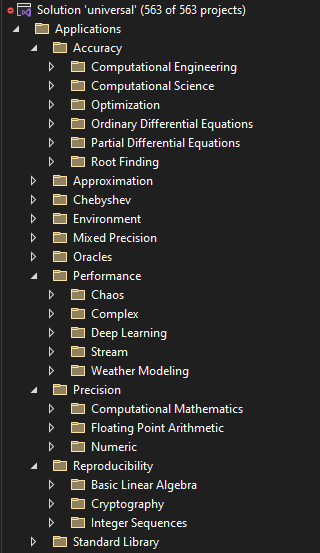

# Universal: a header-only C++ template library of custom arithmetic plug-in types


| **System** | **Status** | **More information** |
|------------|------------|----------------------|
| [Codacy Code Quality](https://app.codacy.com/gh/stillwater-sc/universal/dashboard) | [](https://app.codacy.com/gh/stillwater-sc/universal?utm_source=github.com&utm_medium=referral&utm_content=stillwater-sc/universal&utm_campaign=Badge_Grade_Dashboard) | Code Quality Assessment |
| [FOSSA Status](https://app.fossa.com/projects/git%2Bgithub.com%2Fstillwater-sc%2Funiversal) | [](https://app.fossa.com/projects/git%2Bgithub.com%2Fstillwater-sc%2Funiversal?ref=badge_shield) | Open-source license dependency scanner |
| [GitHub Actions](https://github.com/stillwater-sc/universal/actions) | [](https://github.com/stillwater-sc/universal) | Latest Linux/MacOS/Windows builds and regression tests |
| [Development Branch](https://github.com/stillwater-sc/universal/actions) |  | Development Branch |
| [Regression Status](https://github.com/stillwater-sc/universal/actions) |  | Regression Status |
| [Code Coverage](https://coveralls.io) | [](https://coveralls.io/github/stillwater-sc/universal?branch=main) | Code coverage scanner |
| [Docker Pulls](https://hub.docker.com/r/stillwater/universal) | [](https://hub.docker.com/r/stillwater/universal) | Container pulls |
| [Awesome C++](https://github.com/fffaraz/awesome-cpp) | [](https://github.com/fffaraz/awesome-cpp#math) | Awesome C++ Libraries |
| [JOSS Markdown](https://joss.theoj.org) | [](https://joss.theoj.org/papers/932fdfc2735a85422e4431f27ebfc0d0)  | Journal of Open-Source Software paper |
| [Zenodo](https://zenodo.org/record/7735084) | [](https://doi.org/10.5281/zenodo.7735084) | Zenodo DOI Badge |
-------------------------------


The goal of the Universal Numbers Library is to offer alternatives to native integer and floating-point for mixed-precision algorithm development and optimization. Tailoring the arithmetic types to the application's precision and dynamic range enables a new level of application performance and energy efficiency, particularly valuable for embedded applications that need autonomy through intelligent behavior.

Deep Learning algorithms in particular provide a core application vertical where alternative formats and precisions, such as half-precision floating-point and bfloat16, yield speed-ups of two to three orders of magnitude, making rapid innovation in AI possible.

The Universal Library is a ready-to-use header-only library that provides a plug-in replacement for native types and offers a low-friction environment to explore alternatives to IEEE-754 floating-point in AI, DSP, HPC, and HFT algorithms.

The basic use pattern is as simple as:

```code
// bring in the parameterized type of interest, in this case
// a fixed-sized, arbitrary configuration classic floating-point
#include <universal/number/cfloat/cfloat.hpp>

// define your computational kernel parameterized by arithmitic type
template<typename Real>
Real MyKernel(const Real& a, const Real& b) {
    return a * b;  // replace this with your kernel computation
}

constexpr double pi = 3.14159265358979323846;

int main() {
    // if desired, create an application type alias to avoid errors
    using Real = sw::universal::half; // half-precision IEEE-754 floating-point  

    Real a = sqrt(2);
    Real b = pi;
    // finally, call your kernel with your desired arithmetic type
    std::cout << "Result: " << MyKernel(a, b) << std::endl;  
}
```

The library contains fast implementations of special IEEE-754 formats that do not have universal hardware implementations across x86, ARM, POWER, RISC-V, and GPUs. Special formats such as quarter precision, `quarter`, half-precision, `half`, and quad precision, `quad`, are provided, as well as vendor-specific extensions, such as NVIDIA `TensorFloat`, Google's Brain Float, `bfloat16`, or TI DSP fixed-points, `fixpnt`. In addition to these often-used specializations, *Universal* supports static and elastic integers, decimals, fixed-points, rationals, linear floats, tapered floats, logarithmic, interval and adaptive-precision integers, rationals, and floats. There are example number system skeletons to get you started quickly if you desire to add your own.

## Communication channels

* [GitHub Issue](https://github.com/stillwater-sc/universal/issues): bug reports,
  feature requests, etc.
* [Forum](https://groups.google.com/u/1/g/unum-computing): discussion of alternatives to IEEE-754 for computational science.
* [Slack](https://fptalks.slack.com): online chats, discussions,
  and collaboration with other users, researchers and developers.

## Citation

Please cite [our work](https://joss.theoj.org/papers/10.21105/joss.05072) if you use *Universal*.

Research results using *Universal* arithmetic types are also available:
1. [Reproducibility](https://arxiv.org/abs/2012.11011)
2. [Iterative Refinement](https://arxiv.org/abs/2408.13400)

Lorenz System ODE solver using low-precision posits:


## Bibtex records
```bib
@article{Quinlan:2024,
    author     = {James Quinlan, E. Theodore L. Omtzigt},
    title      = {Iterative Refinement with Low-Precision Posits},
    journal    = {arXiv:2408.13400},
    year       = {2024},
}

@article{omtzigt2023universal,
  title={Universal Numbers Library: Multi-format Variable Precision Arithmetic Library},
  author={Omtzigt, E Theodore L and Quinlan, James},
  journal={Journal of Open Source Software},
  volume={8},
  number={83},
  pages={5072},
  year={2023}
}

@inproceedings{Omtzigt:2022,
  title        = {Universal: Reliable, Reproducible, and Energy-Efficient Numerics},
  author       = {E. Theodore L. Omtzigt and James Quinlan},
  booktitle    = {Conference on Next Generation Arithmetic},
  pages        = {100--116},
  year         = {2022},
  organization = {Springer}
}

@article{Omtzigt2020,
    author     = {E. Theodore L. Omtzigt and Peter Gottschling and Mark Seligman and William Zorn},
    title      = {{Universal Numbers Library}: design and implementation of a high-performance reproducible number systems library},
    journal    = {arXiv:2012.11011},
    year       = {2020},
}
```

## Talks and Presentations

The following presentations describe *Universal* and the number systems it contained as of the time of publication.

Slides of a presentation at [FPTalks'21](https://fpbench.org/talks/fptalks21.html)

[Presentation: Application-Driven Custom Number Systems](https://drive.google.com/file/d/1fPvJ5kjjNKY9TiVCBX8xwb5czGNd87Dr/view)

Slides of the presentation at [CoNGA'22](https://link.springer.com/book/10.1007/978-3-031-09779-9)

[Presentation: Universal: Reliable, Reproducible, and Energy-Efficient Numerics](docs/presentations/conga22-universal-arithmetic-library.pdf)

A quick description of the structure of the number system parameterization can be found [here](docs/number-system-type-parameterization.md).

## Quick start

If you just want to experiment with the number system tools and test suites and don't want to bother cloning and building the source code, there is a Docker container to get started:

```text
> docker pull stillwater/universal
> docker run -it --rm stillwater/universal bash
stillwater@b3e6708fd732:~/universal/build$ ls
CMakeCache.txt       Makefile      cmake-uninstall.cmake  playground  universal-config-version.cmake
CMakeFiles           applications  cmake_install.cmake    tests       universal-config.cmake
CTestTestfile.cmake  c_api         education              tools       universal-targets.cmake
```

[Here](docs/command-line-tools.md) is a quick reference of what the command line tools have to offer.

## How to build

If you do want to work with the code, the universal numbers software library is built using cmake version v3.23. 
Install the latest [cmake](https://cmake.org/download).
There are interactive installers for MacOS and Windows. 
For Linux, a portable approach downloads the shell archive and installs it at /usr/local:

```text
> wget https://github.com/Kitware/CMake/releases/download/v3.23.1/cmake-3.23.1-Linux-x86_64.sh 
> sudo sh cmake-3.23.1-Linux-x86_64.sh --prefix=/usr/local --exclude-subdir
```

For Ubuntu, snap will install the latest cmake, and would be the preferred method:

```text
> sudo snap install cmake --classic
```

The Universal Library is a pure C++ template library without any further dependencies, 
even for the regression test suites to enable hassle-free installation and use.

Clone the GitHub repo, and you are ready to build the different components of the Universal library.  
The library contains tools for using integers, decimals, fixed-points, floats, posits, valids, and logarithmic
number systems. It includes educational programs that showcase simple use cases to familiarize yourself with
different number systems and application examples to highlight the use of other number systems to gain performance
or numerical accuracy. Finally, each number system offers its own verification suite. 

The easiest way to become familiar with all the options in the build process is to fire up the CMake GUI (or ccmake if you are on a headless server). The CMake output will summarize which options have been set.  
The output will look something like this:

```text
$ git clone https://github.com/stillwater-sc/universal
$ cd universal
$ mkdir build
$ cd build
$ cmake ..

 _____  _____  ____  _____  _____  ____   ____  ________  _______     ______        _       _____
|_   _||_   _||_   \|_   _||_   _||_  _| |_  _||_   __  ||_   __ \  .' ____ \      / \     |_   _|
  | |    | |    |   \ | |    | |    \ \   / /    | |_ \_|  | |__) | | (___ \_|    / _ \      | |
  | '    ' |    | |\ \| |    | |     \ \ / /     |  _| _   |  __ /   _.____`.    / ___ \     | |   _
   \ \__/ /    _| |_\   |_  _| |_     \ ' /     _| |__/ | _| |  \ \_| \____) | _/ /   \ \_  _| |__/ |
    `.__.'    |_____|\____||_____|     \_/     |________||____| |___|\______.'|____| |____||________|

-- The C compiler identification is GNU 9.4.0
-- The CXX compiler identification is GNU 9.4.0
-- The ASM compiler identification is GNU
-- Found assembler: /usr/bin/cc
-- Detecting C compiler ABI info
-- Detecting C compiler ABI info - done
-- Check for working C compiler: /usr/bin/cc - skipped
-- Detecting C compile features
-- Detecting C compile features - done
-- Detecting CXX compiler ABI info
-- Detecting CXX compiler ABI info - done
-- Check for working CXX compiler: /usr/bin/c++ - skipped
-- Detecting CXX compile features
-- Detecting CXX compile features - done
-- No default build type specified: setting CMAKE_BUILD_TYPE=Release
-- C++20 has been enabled by default
-- Performing Test COMPILER_HAS_SSE3_FLAG
-- Performing Test COMPILER_HAS_SSE3_FLAG - Success
-- Performing Test COMPILER_HAS_AVX_FLAG
-- Performing Test COMPILER_HAS_AVX_FLAG - Success
-- Performing Test COMPILER_HAS_AVX2_FLAG
-- Performing Test COMPILER_HAS_AVX2_FLAG - Success
--
-- PROJECT_NAME                = universal
-- PROJECT_NAME_NOSPACES       = universal
-- PROJECT_SOURCE_DIR          = /home/stillwater/dev/clones/universal
-- PROJECT_VERSION             = 3.68.1.80df9073
-- CMAKE_C_COMPILER            = /usr/bin/cc
-- CMAKE_CXX_COMPILER          = /usr/bin/c++
-- CMAKE_CURRENT_SOURCE_DIR    = /home/stillwater/dev/clones/universal
-- CMAKE_CURRENT_BINARY_DIR    = /home/stillwater/dev/clones/universal/build_gcc
-- GIT_COMMIT_HASH             = 80df9073
-- GIT_BRANCH                  = v3.68
-- include_install_dir         = include
-- include_install_dir_full    = include/universal
-- config_install_dir          = share/universal
-- include_install_dir_postfix = universal
--
-- ******************* Universal Arithmetic Library Configuration Summary *******************
-- General:
--   Version                          :   3.68.1.80df9073
--   System                           :   Linux
--   C++ Language Requirement         :   C++20
--   C compiler                       :   /usr/bin/cc
--   Release C flags                  :   -O3 -DNDEBUG -Wall -Wpedantic -Wno-narrowing -Wno-deprecated
--   Debug C flags                    :   -g -Wall -Wpedantic -Wno-narrowing -Wno-deprecated
--   C++ compiler                     :   /usr/bin/c++
--   Release CXX flags                :   -O3 -DNDEBUG   -Wall -Wpedantic -Wno-narrowing -Wno-deprecated -Wall -Wpedantic -Wno-narrowing -Wno-deprecated
--   Debug CXX flags                  :   -g   -Wall -Wpedantic -Wno-narrowing -Wno-deprecated -Wall -Wpedantic -Wno-narrowing -Wno-deprecated
--   Build type                       :   Release
--
--   BUILD_ALL                        :   OFF
--   BUILD_CI                         :   OFF
--
--   BUILD_DEMONSTRATION              :   ON
--   BUILD_NUMBERS                    :   OFF
--   BUILD_NUMERICS                   :   OFF
--   BUILD_BENCHMARKS                 :   OFF
--   BUILD_MIXEDPRECISION_SDK         :   OFF
--
--   BUILD_CMD_LINE_TOOLS             :   ON
--   BUILD_EDUCATION                  :   ON
--   BUILD_APPLICATIONS               :   ON
--   BUILD_PLAYGROUND                 :   ON
--
--   BUILD_NUMBER_INTERNALS           :   OFF
--   BUILD_NUMBER_NATIVE_TYPES        :   OFF
--   BUILD_NUMBER_ELASTICS            :   OFF
--   BUILD_NUMBER_STATICS             :   OFF
--   BUILD_NUMBER_CONVERSIONS         :   OFF
--
--   BUILD_NUMBER_EINTEGERS           :   OFF
--   BUILD_NUMBER_DECIMALS            :   OFF
--   BUILD_NUMBER_RATIONALS           :   OFF
--   BUILD_NUMBER_EFLOATS             :   OFF
--   BUILD_NUMBER_EPOSITS             :   OFF
--
--   BUILD_NUMBER_INTEGERS            :   OFF
--   BUILD_NUMBER_FIXPNTS             :   OFF
--   BUILD_NUMBER_BFLOATS             :   OFF
--   BUILD_NUMBER_CFLOATS             :   OFF
--   BUILD_NUMBER_DFLOATS             :   OFF
--   BUILD_NUMBER_AREALS              :   OFF
--   BUILD_NUMBER_UNUM1S              :   OFF
--   BUILD_NUMBER_UNUM2S              :   OFF
--   BUILD_NUMBER_POSITS              :   OFF
--   BUILD_NUMBER_VALIDS              :   OFF
--   BUILD_NUMBER_LNS                 :   OFF
--   BUILD_NUMBER_LNS2B               :   OFF
--   BUILD_NUMBER_SORNS               :   OFF
--
--   BUILD_NUMERIC_FUNCTIONS          :   OFF
--   BUILD_NUMERIC_QUIRES             :   OFF
--   BUILD_NUMERIC_CHALLENGES         :   OFF
--   BUILD_NUMERIC_UTILS              :   OFF
--   BUILD_NUMERIC_FPBENCH            :   OFF
--
--   BUILD_BENCHMARK_ERROR            :   OFF
--   BUILD_BENCHMARK_ACCURACY         :   OFF
--   BUILD_BENCHMARK_REPRODUCIBILITY  :   OFF
--   BUILD_BENCHMARK_PERFORMANCE      :   OFF
--   BUILD_BENCHMARK_ENERGY           :   OFF
--
--   BUILD_MIXEDPRECISION_ROOTS       :   OFF
--   BUILD_MIXEDPRECISION_APPROXIMATE :   OFF
--   BUILD_MIXEDPRECISION_INTEGRATE   :   OFF
--   BUILD_MIXEDPRECISION_INTERPOLATE :   OFF
--   BUILD_MIXEDPRECISION_OPTIMIZE    :   OFF
--   BUILD_MIXEDPRECISION_TENSOR      :   OFF
--
--   BUILD_LINEAR_ALGEBRA_BLAS        :   OFF
--   BUILD_LINEAR_ALGEBRA_VMATH       :   OFF
--
--
--   BUILD_C_API_PURE_LIB             :   OFF
--   BUILD_C_API_SHIM_LIB             :   OFF
--   BUILD_C_API_LIB_PIC              :   OFF
--   BUILD_DOCS                       :   OFF
--
-- Regression Testing Level:
--   BUILD_REGRESSION_SANITY          :   ON
--
-- Dependencies:
--   SSE3                             :   NO
--   AVX                              :   NO
--   AVX2                             :   NO
--   Pthread                          :   NO
--   TBB                              :   NO
--   OMP                              :   NO
--
-- Utilities:
--   Serializer                       :   NO
--
-- Install:
--   Install path                     :   /usr/local
--

 _____  _____  ____  _____  _____  ____   ____  ________  _______     ______        _       _____
|_   _||_   _||_   \|_   _||_   _||_  _| |_  _||_   __  ||_   __ \  .' ____ \      / \     |_   _|
  | |    | |    |   \ | |    | |    \ \   / /    | |_ \_|  | |__) | | (___ \_|    / _ \      | |
  | '    ' |    | |\ \| |    | |     \ \ / /     |  _| _   |  __ /   _.____`.    / ___ \     | |   _
   \ \__/ /    _| |_\   |_  _| |_     \ ' /     _| |__/ | _| |  \ \_| \____) | _/ /   \ \_  _| |__/ |
    `.__.'    |_____|\____||_____|     \_/     |________||____| |___|\______.'|____| |____||________|

-- Configuring done
-- Generating done
```

As you can see in the cmake output there are many build targets. Each build target is designed to provide
focus and fast build turnarounds when working with different number systems. Each number system has its
own build target allowing fast and efficient regression testing.

The build options are enabled/disabled as follows:

```text
> cmake -DBUILD_EDUCATION=OFF -DBUILD_NUMBER_POSITS=ON ..
```

After building, issue the command _make test_ to run the complete test suite of all the enabled components, 
as a regression capability when you are modifying the source code. This will take touch all the corners of the code.

```text
> git clone https://github.com/stillwater-sc/universal
> cd universal
> mkdir build
> cd build
> cmake ..
> make -j $(nproc)
> make test
```

For Windows and Visual Studio, there are `CMakePredefinedTargets` that accomplish the same tasks:

```text
    - ALL_BUILD will compile all the projects
    - INSTALL   will install the Universal library
    - RUN_TESTS will run all tests
```

Here is the layout of all the projects contained in V3.68 of Universal:


In the *Applications* section, you will find application examples to demonstrate the use of Universal 
arithmetic types to accomplish different numerical goals, such as reproducibility, accuracy, performance,
or precision. These examples are great starting points for your own application requirements.



## How to develop and extend *Universal*

The *Universal* library contains hundreds of example programs to demonstrate the use of the arithmetic types and the enable new developers to get up to speed. In each number system type's regression suite there is an `api/api.cpp` that chronicles all the invokation and use cases to provide an executable example of how to use the type. In general, the api section of the regression tests has code examples how to use the different library components, such as manipulators, attributes, number traits, exceptions, and special cases. 

In the `education` build target (BUILD_EDUCATION), there are individual test programs that demonstrate how to use the different types.

The `docs` directory contains the descriptions of the [command line tools](docs/command-line-tools.md), a [tutorial](docs/number-system-type-parameterization.md) explaining the parameterization design of the arithmetic types in *Universal*, several conference presentations, [FPTalks](docs/presentations/fptalks-custom-number-systems.pdf) and [CoNGA22](docs/presentations/conga22-universal-arithmetic-library.pdf), describing the arithmetic types. The `docs` directory also contains ready-to-use value tables and dynamic range comparisons of many key small arithmetic types of interest in AI and DSP applications.

Each number system comes with a complete regression suite to verify the functionality of assignment, conversion, arithmetic, logic, exceptions, number traits, and special cases. These regression suites are run for each PR or push to the version branch. *Universal* uses standard GitHub Actions for this, so add your branch to the workflow cmake yaml to trigger CI for your own branch.

The easiest way to get started is to pick up and copy the directory structure under `ROOT/include/universal/number/skeleton_1param` or `ROOT/include/universal/number/skeleton_2params`. They are configured to get you all the constituent pieces of a number system *Universal*-style.

# Installation and usage

After cloning the library, building and testing it in your environment, you can install it via:

```text
> cd universal/build
> cmake .. -DCMAKE_INSTALL_PREFIX:PATH=/your/installation/path
> cmake --build . --config Release --target install -- -j $(nproc)
```

or manually via the Makefile target in the build directory:

```text
> make -j $(nproc) install
```

The default install directory is `/usr/local` under Linux.  There is also an _uninstall_ command:

```text
> make uninstall
```

If you want to use the number systems provided by Universal in your own project, 
you can use the following CMakeLists.txt structure:

```code
project("my-numerical-experiment")

find_package(UNIVERSAL CONFIG REQUIRED)

add_executable(${PROJECT_NAME} src/mymain.cpp)
set_property(TARGET ${PROJECT_NAME} PROPERTY CXX_STANDARD 17)
target_link_libraries(${PROJECT_NAME} universal::universal)
```

## Controlling the build to include different components

The default build configuration will build the command line tools, a playground, educational and 
application examples. If you want to build the full regression suite across all the number systems, 
use the following cmake command:

```text
cmake -DBUILD_ALL=ON ..
```

For performance, the build configuration can enable specific x86 instruction sets (SSE/AVX/AVX2). 
For example, if your processor supports the AVX2 instruction set, you can build the test suites 
and educational examples with the AVX2 flag turned on. This typically yields a 20% performance boost.

```text
cmake -DBUILD_ALL=on -DUSE_AVX2=ON ..
```

The library builds a set of useful command utilities to inspect native IEEE float/double/long double 
types, as well as the custom number systems provided by Universal. Assuming you have build and 
installed the library, the inspection commands available are:

```text
    ieee           -- show the components of the full set of IEEE floating point values
    quarter        -- show the components and traits of a quarter precision floating-point value (FP8)
    half           -- show the components and traits of a half precision IEEE-754 value (FP16)
    single         -- show the components and traits of a single precision IEEE-754 value (FP32)
    double         -- show the components and traits of a double precision IEEE-754 value (FP64)
    longdouble     -- show the components and traits of a native long double IEEE-754 value
    quad           -- show the components and traits of a quad precision IEEE-754 value (FP128)

    signedint      -- show the components and traits of a signed integer value
    unsignedint    -- show the components and traits of an unsigned integer value
    fixpnt         -- show the components and traits of a fixed-point value
    posit          -- show the components and traits of a posit value
    lns            -- show the components and traits of a logarithmic number system value

    float2posit    -- show the conversion process of a Real value to a posit

    propenv        -- show the properties of the execution (==compiler) environment that built the library
    propp          -- show numerical properties of a posit environment including the associated quire
    propq          -- show numerical properties of a quire
```

For example:

```text
$ ieee 1.234567890123456789012
compiler              : 7.5.0
float precision       : 23 bits
double precision      : 52 bits
long double precision : 63 bits

Decimal representations
input value:             1.23456789012
      float:                1.23456788
     double:        1.2345678901199999
long double:    1.23456789011999999999

Hex representations
input value:             1.23456789012
      float:                1.23456788    hex: 0.7f.1e0652
     double:        1.2345678901199999    hex: 0.3ff.3c0ca428c1d2b
long double:    1.23456789011999999999    hex: 0.3fff.1e06521460e95b9a

Binary representations:
      float:                1.23456788    bin: 0.01111111.00111100000011001010010
     double:        1.2345678901199999    bin: 0.01111111111.0011110000001100101001000010100011000001110100101011
long double:    1.23456789011999999999    bin: 0.011111111111111.001111000000110010100100001010001100000111010010101101110011010

Native triple representations (sign, scale, fraction):
      float:                1.23456788    triple: (+,0,00111100000011001010010)
     double:        1.2345678901199999    triple: (+,0,0011110000001100101001000010100011000001110100101011)
long double:    1.23456789011999999999    triple: (+,0,001111000000110010100100001010001100000111010010101101110011010)

Universal triple representation (sign, scale, fraction):
input value:             1.23456789012
      float:                1.23456788    triple: (+,0,00111100000011001010010)
     double:        1.2345678901199999    triple: (+,0,0011110000001100101001000010100011000001110100101011)
long double:    1.23456789011999999999    triple: (+,0,001111000000110010100100001010001100000111010010101101110011010)
      exact: TBD
```

This _ieee_ command is very handy to quickly determine how your development environment represents (truncates) a specific value. 

The specific commands _single_, _double_, and _longdouble_ focus on float, double, and long double representations respectively.

There is also a command _posit_ to help you visualize and compare the posit component fields for a given value, for example:

```text
$ posit 1.234567890123456789012
posit< 8,0> = s0 r10 e f01000 qNE v1.25
posit< 8,1> = s0 r10 e0 f0100 qNE v1.25
posit< 8,2> = s0 r10 e00 f010 qNE v1.25
posit< 8,3> = s0 r10 e000 f01 qNE v1.25
posit<16,1> = s0 r10 e0 f001111000001 qNE v1.234619140625
posit<16,2> = s0 r10 e00 f00111100000 qNE v1.234375
posit<16,3> = s0 r10 e000 f0011110000 qNE v1.234375
posit<32,1> = s0 r10 e0 f0011110000001100101001000011 qNE v1.2345678918063641
posit<32,2> = s0 r10 e00 f001111000000110010100100001 qNE v1.2345678880810738
posit<32,3> = s0 r10 e000 f00111100000011001010010001 qNE v1.2345678955316544
posit<48,1> = s0 r10 e0 f00111100000011001010010000101000110001011010 qNE v1.2345678901234578
posit<48,2> = s0 r10 e00 f0011110000001100101001000010100011000101101 qNE v1.2345678901234578
posit<48,3> = s0 r10 e000 f001111000000110010100100001010001100010110 qNE v1.2345678901233441
posit<64,1> = s0 r10 e0 f001111000000110010100100001010001100010110011111101100000000 qNE v1.2345678901234567
posit<64,2> = s0 r10 e00 f00111100000011001010010000101000110001011001111110110000000 qNE v1.2345678901234567
posit<64,3> = s0 r10 e000 f0011110000001100101001000010100011000101100111111011000000 qNE v1.2345678901234567
```

The fields are prefixed by their first characters, for example, "posit<16,2> = s0 r10 e00 f00111100000 qNE v1.234375"

-   sign     field = s0, indicating a positive number
-   regime   field = r10, indicates the first positive regime, named regime 0
-   exponent field = e00, indicates two bits of exponent, both 0
-   fraction field = f00111100000, a full set of fraction bits

The field values are followed by a quadrant descriptor and a value representation in decimal:

-   qNE            = North-East Quadrant, representing a number in the range "[1, maxpos]"
-   v1.234375      = the value representation of the posit projection


The positive regime for a posit shows a very specific structure, as can be seen in the image blow:


## Leveraging the *Universal* library in your own mixed-precision algorithm research

To bootstrap any new mixed-precision algorithm development and optimization project quickly and robustly, there is a github template repo available that will set up a complete working development environment with dependent libraries, development containers, VS Code integration, and a Github CI workflow. The template repo can be found at [mpadao-template](https://github.com/stillwater-sc/mpadao-template). 

The template repo is the easiest way to get started with mixed-precision algorithm development using *Universal*.

## Motivation

Modern Deep Learning AI applications are very demanding high-performance applications. Runtimes to train
models are measured in terms of weeks, and target latencies for inference are 10-100msec. Standard
double, and even single, precision IEEE-754 floating-point have been too expensive to use in addressing the 
performance and power requirements of AI applications in both the cloud and the edge.
Both Google and Microsoft have jettisoned traditional floating-point formats for their AI cloud services 
to gain two orders of magnitude better performance. Similarly, AI applications for mobile and embedded 
applications are requantized to small integers to fit their very stringent power budgets. The AI domain
has been researching better number systems to address both power and performance requirements,
but all these efforts have worked in isolation, with results being difficult to reproduce.

AI applications are only some of the applications that expose the limitations of traditional hardware. Inefficiencies in numeric storage and operations also limit cloud scale, IoT, embedded, and HPC applications. A simple change to a new number system may improve the scale and cost of these applications by orders of magnitude.

When performance and power efficiency are the differentiating attributes for a use case, arithmetic systems that are tailored to the needs of the application are desired.

In particular, there are two concerns when using the IEEE-754 floating-point formats: 

-   inefficient representation of the real numbers
-   irreproducibility in the context of concurrency

More specifically, 

1.   **Wasted Bit Patterns** 
    -   32-bit IEEE floating point has around eight million ways to represent NaN (Not-A-Number), while the 64-bit floating point has two quadrillion, which is approximately 2.251x10^15 to be more exact.  A NaN is an exceptional value to represent undefined or invalid results, such as the result of a division by zero.
2.   **Mathematically Incorrect** 
    -   The format specifies two zeroes, a negative and positive zero, with different behaviors. 
    -   Loss of associative and distributive law due to rounding after each operation.  This loss of associative and distributive arithmetic behavior creates an irreproducible result of concurrent programs that use the IEEE floating point.  This is particularly problematic for embedded and control applications.
3.   **Overflows to ± inf and underflows to 0** 
    -   Overflowing to ± inf increases the relative error by an infinite factor while underflowing to 0 loses sign information.
4.   **Unused dynamic range** 
    -   The dynamic range of double precision floats is a whopping 2^2047, whereas most numerical software is architected to operate around 1.0.
5.   **Complicated Circuitry** 
    -   Denormalized floating point numbers have a hidden bit of 0 instead of 1.  This creates a host of special handling requirements that complicate compliant hardware implementations.
6.   **No Gradual Overflow and Fixed Accuracy** 
    -   If accuracy is defined as the number of significand bits, IEEE floating-point has fixed accuracy for all numbers except denormalized numbers because the number of signficand digits is fixed.  Denormalized numbers are characterized by decreased significand digits when the value approaches zero due to having a zero hidden bit.  Denormalized numbers fill the underflow gap (i.e., between zero and the least non-zero values).  The counterpart for gradual underflow is gradual overflow which does not exist in IEEE floating points.

In contrast, the _posit_ number system was designed to overcome these negatives: 

1.   **Economical** 
    -   No bit patterns are redundant.  There is one representation for infinity denoted as ± inf and zero.  All other bit patterns are valid distinct non-zero real numbers. ± inf serves as a replacement for NaN.
2.   **Preserves Mathematical Properties** 
    -   There is only one representation for zero, and the encoding is symmetric around 1.0.  Associative and distributive laws are supported through deferred rounding via the quire, enabling reproducible linear algebra algorithms in any concurrency environment.
3.   **Tapered Accuracy** 
    -   Tapered accuracy is when values with small exponents have more precision and values with large exponents have fewer digits of accuracy.  This concept was first introduced by Morris (1971) in his paper ”Tapered Floating Point: A New Floating-Point Representation”.
4.   **Parameterized precision and dynamic range** 
    -   posits are defined by a size, _nbits_, and the number of exponent bits, _es_. This enables system designers the freedom to pick the right precision and dynamic range required for the application.  For example, we may pick 5- or 6-bit posits without any exponent bits for AI applications to improve performance.  For embedded DSP applications, such as 5G base stations, we may select a 16-bit posit with one exponent bit to improve performance per Watt.
5.   **Simpler Circuitry** 
    -   There are only two exceptional cases, Not a Real and Zero.  No denormalized numbers, overflow, or underflow. 

However as Deep Learning has demonstrated, there are many different requirements to optimize an arithmetic and
tailor it to the needs of the application. Universal brings all the machinery together to experiment to 
facilitate efficient contrast and compare different arithmetic number system designs, before committing them
to hardware.

## Goals of the library

The *Universal* library started as a bit-level arithmetic reference implementation of the evolving unum Type III 
(posit and valid) standard. However, the demands for supporting number systems, such as adaptive-precision integers 
to solve large factorials, adaptive-precision floats to act as Oracles, or comparing linear and tapered floats 
provided the opportunity to create a complete platform for numerical analysis and computational mathematics. 
With this *Universal* platform, we enable a new direction for optimizing algorithms to take advantage of mixed-precision 
computation to maximize performance and minimize energy demands. Energy efficiency is going to be the
key differentiator for embedded intelligence applications.

As a reference library, *Universal* offers an extensive test infrastructure to validate number system 
arithmetic operations, and there is a host of utilities to inspect the internal encodings and operations 
of the different number systems.

The design space for custom arithmetic is vast, and any contribution to expanding the capability of 
the *Universal* library is encouraged. 


## Contributing to universal

We are happy to accept pull requests via GitHub. The only requirement is that the entire regression test suite passes.

[](https://starchart.cc/stillwater-sc/universal)

## Verification Suite

Typically, the verification suite is run as part of the build directory's _make test_ command. However, it is possible to run specific test suite components, for example, to validate algorithmic changes to more complex arithmetic functions, such as square root, exponent, logarithm, and trigonometric functions.

Here is an example:

```text
>:~/dev/universal/build$  make posit_logarithm
[ 50%] Building CXX object static/posit/CMakeFiles/posit_logarithm.dir/math/logarithm.cpp.o
[100%] Linking CXX executable posit_logarithm
[100%] Built target posit_logarithm
>:~/dev/universal/build$ static/posit/posit_logarithm
posit logarithm function validation: results only
               4 -> log(4) =  1.3862943649292
0110000000000000 -> log(4) = 0100011000101110 (reference: 0100011000101110)   PASS

posit<2,0>                                                   log PASS
posit<3,0>                                                   log PASS
posit<3,1>                                                   log PASS
posit<4,0>                                                   log PASS
posit<4,1>                                                   log PASS
posit<5,0>                                                   log PASS
posit<5,1>                                                   log PASS
posit<5,2>                                                   log PASS
posit<8,4>                                                   log PASS
posit<8,4>                                                   log2 PASS
posit<8,4>                                                   log10 PASS
posit logarithm function validation: PASS
```

## Structure of the tree

The universal library contains a set of functional groups to organize the development and validation of 
different number systems. Each number system type has a single include file that brings together
the arithmetic number type and all the extensions that *Universal* has standardized so that
working with numeric types is more productive. For example, facilities for number traits, an 
arithmetic exception hierarchy, number system attributes, manipulators,
and finally, a math library specialized for the type.

The number system types are categorized as _static_ or _elastic_. Static types are arithmetic types
that have a constant, that is _static_ size, and thus can be used for sharing composite data structures, 
such as matrices and tensors, between general-purpose CPUs and special-purpose hardware accelerators.
Elastic types are arithmetic types that can grow and shrink during computation, typically to accommodate
error-free, or closed computations.

In addition to the _static_ and _elastic_ classification, we also recognize that the base of the number
system is a key parameter in the arithmetic and numerical traits of the type. In particular, the tree
will specialize in binary and decimal forms of arithmetic.

Here is a complete list:

### _static_ fixed-sized configurations

- *universal/number/integer* - arbitrary configuration fixed-size integer
- *universal/number/fixpnt* - arbitrary configuration fixed-size fixed-point number system
- *universal/number/areal* - arbitrary configuration fixed-size faithful floating-point with uncertainty bit
- *universal/number/cfloat* - arbitrary configuration fixed-size classic floating-point number system
- *universal/number/posit* - arbitrary configuration fixed-size posit number system, a tapered floating-point
- *universal/number/valid* - arbitrary configuration fixed-size valid number system, a tapered floating-point interval number system
- *universal/number/unum* - arbitrary configuration unum Type 1 number system
- *universal/number/unum2* - arbitrary configuration unum Type 2 number system
- *universal/number/lns* - arbitrary configuration logarithmic number system with fixed-point exponent
- *universal/number/dbns* - double base number system with integer exponents
- *universal/number/sorn* - set of real numbers 
- *universal/number/dd* - multi-component double-double floating-point format 
- *universal/number/qd* - multi-component quad-double floating-point format 

### _elastic_ adaptive-precision configurations

- *universal/number/decimal* - adaptive-precision decimal integer
- *universal/number/einteger* - adaptive-precision binary integer
- *universal/number/erational* - adaptive-precision rational number system
- *universal/number/efloat* - multi-digit adaptive-precision floating-point
- *universal/number/ereal* - multi-component adaptive-precision floating-point
- *universal/number/elreal* - multi-component exact lazy floating-point

### super-accumulator facilities

- *universal/number/quire* - arbitrary configuration fixed-size super accumulator number system (add/sub/abs/sqrt)
- *universal/number/float* - contains the implementation of the IEEE floating point augmentations for reproducible computation

And each of these functionality groups has an associated test suite located in ".../universal/tests/..."


## Background information

Universal numbers, unums for short, express real numbers and ranges of real numbers. There are two modes of operation, selectable by the programmer, _posit_ mode and _valid_ mode.

In _posit_ mode, a unum behaves like a floating-point number of fixed size, rounding to the nearest expressible value if the result of a calculation is not expressible exactly.
A posit offers more accuracy and a wider dynamic range than floats with the same number of bits.

In _valid_ mode, a unum represents a range of real numbers and can be used to bound answers rigorously, much as interval arithmetic does.

Posit configurations have a specific relationship to one another. When expanding a posit, the new value falls 'between' the old values of the smaller posit. The new value is the arithmetic mean of the two numbers if the expanding bit is a fraction bit, and it is the geometric mean of the two numbers if the expanding bit is a regime or exponent bit. 
This [page](docs/PositRefinementViz.md) shows a visualization of the expansion of _posit<2,0>_ to _posit<7,1>_:

## Documentation

The [docs](docs/README.md) directory contains design documents and tutorials for the _Universal_ library types.


## Public Domain and community resources

The unum format is a public domain specification and a collection of web resources to manage information and discussions using unums.

[Posit Hub](https://posithub.org)

[Unum-computing Google Group](https://groups.google.com/forum/#!forum/unum-computing)


## Projects that leverage posits

[Matrix Template Library](http://simunova.com/#en-mtl4-index-html)

The Matrix Template Library incorporates modern C++ programming techniques to provide an easy and intuitive interface to users while enabling optimal performance. The natural mathematical notation in MTL4 empowers all engineers and scientists to implement their algorithms and models in minimal time. All technical aspects are encapsulated in the library. Think of it as MATLAB for applications.

[G+SMO](http://gs.jku.at/gismo) 

G+Smo (Geometry + Simulation Modules, pronounced "gismo") is a new open-source C++ library that brings together mathematical tools for geometric design and numerical simulation. It is developed mainly by researchers and PhD students. It implements the relatively new paradigm of isogeometric analysis, which suggests the use of a unified framework in the design and analysis pipeline. G+Smo is an object-oriented, cross-platform, template C++ library and follows the generic programming principle, with a focus on both efficiency and ease of use. The library is partitioned into smaller entities, called modules. Examples of available modules include the dimension-independent NURBS module, the data fitting and solid segmentation module, the PDE discretization module and the adaptive spline module, based on hierarchical splines of arbitrary dimension and polynomial degree. 

[FEniCS](https://fenicsproject.org/)

FEniCS is a popular open-source (LGPLv3) computing platform for solving partial differential equations (PDEs). FEniCS enables users to quickly translate scientific models into efficient finite element code. With the high-level Python and C++ interfaces to FEniCS, it is easy to get started, but FEniCS offers also powerful capabilities for more experienced programmers. FEniCS runs on a multitude of platforms ranging from laptops to high-performance clusters.


[ODEINT-v2](http://headmyshoulder.github.io/odeint-v2/)

Odeint is a modern C++ library for numerically solving Ordinary Differential Equations. It is developed in a generic way using Template Metaprogramming which leads to extraordinary high flexibility at top performance. The numerical algorithms are implemented independently of the underlying arithmetics. This results in an incredible applicability of the library, especially in non-standard environments. For example, odeint supports matrix types, arbitrary precision arithmetics and even can be easily run on CUDA GPUs.

Several AI and Deep Learning libraries are being reengineered to enable the use of posits for both training and inference. They will be announced as they are released.


## License
[](https://app.fossa.com/projects/git%2Bgithub.com%2Fstillwater-sc%2Funiversal?ref=badge_large)
