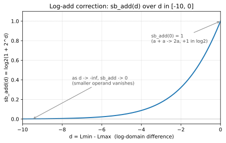
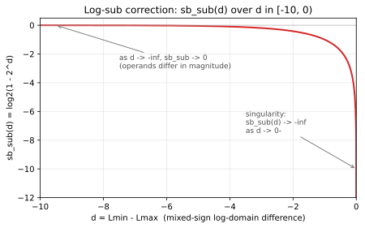
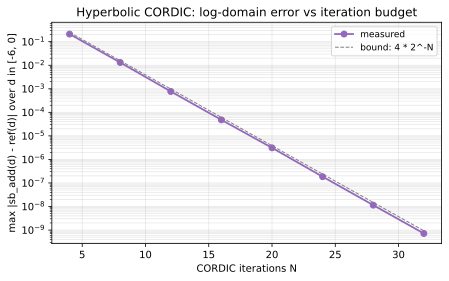
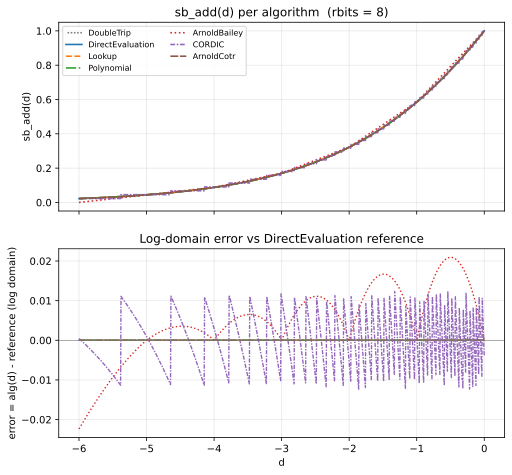
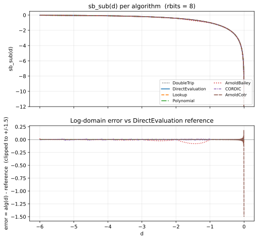
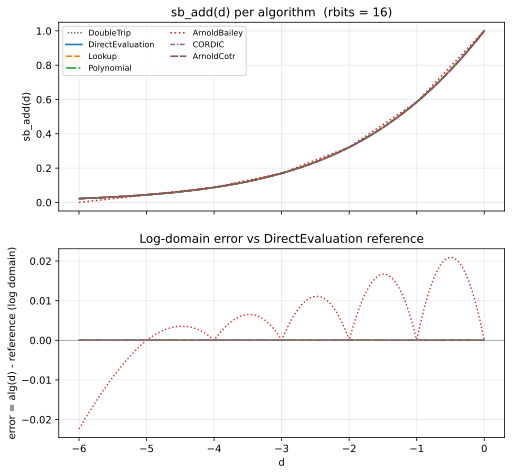
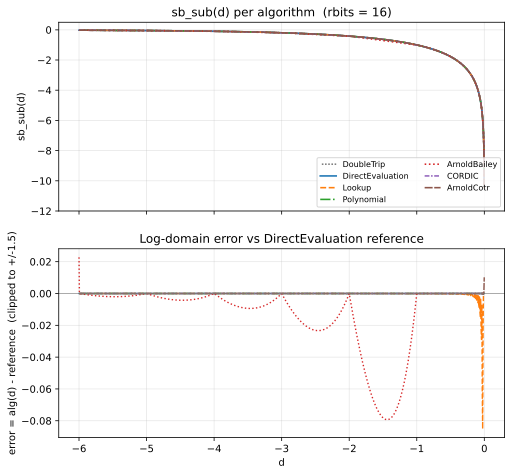
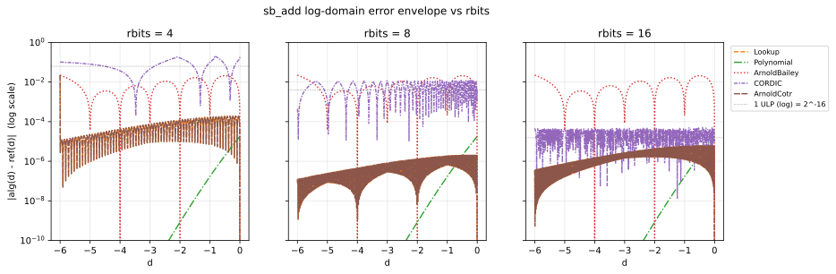

# LNS log-domain add/sub algorithms

This document gives the mathematical derivation of the seven add/sub algorithms
that Universal's `lns` template ships with, the transfer functions they
approximate, and a decision tree for picking one for a given target.

It is the educational companion to:

- the implementation at `include/sw/universal/number/lns/lns_addsub_algorithms.hpp`
- the design rationale at `docs/design/lns-add-sub.md`
- the per-iteration CORDIC convergence study at `docs/design/cordic-precision-assessment.md`
- the per-algorithm benchmark at `benchmark/performance/arithmetic/lns/log_add_algorithms.cpp`

All formulae are written in ASCII; mathematical symbols use the conventions
listed in the project CLAUDE.md (`log2`, `^` for power, `<=` for less-or-equal,
`->` for limits, `2^x` for `pow(2, x)`).

## 1. Why log-domain addition is the hard case

In the logarithmic number system, a real value `x > 0` is encoded by its
log: `L_x = log2(x)`. Multiplication and division become integer-grade
operations on the encoded exponent:

```text
x * y  ->  L_x + L_y
x / y  ->  L_x - L_y
x^k    ->  k * L_x
```

Addition is the difficulty. There is no closed-form expression for
`log2(x + y)` in terms of `L_x` and `L_y` alone -- you must cross back into
the linear domain through a transcendental. The Gauss log-add formulation
makes the irreducible work explicit. For two same-sign positive values
`a, b` with `L_a >= L_b`:

```text
log2(a + b) = log2(2^L_a + 2^L_b)
            = log2( 2^L_a * (1 + 2^(L_b - L_a)) )
            = L_a + log2(1 + 2^d),    d = L_b - L_a <= 0
            = L_a + sb_add(d)
```

The correction term `sb_add(d) = log2(1 + 2^d)` is a one-dimensional, smooth,
monotone non-increasing function of `d` over `d <= 0`. For mixed-sign
operands the analogous correction is `sb_sub(d) = log2(1 - 2^d)`, which has
a vertical tangent (catastrophic cancellation) as `d -> 0-` and equals
`-inf` exactly at `d = 0` (the `a + (-a) = 0` case).

So the entire question of "how to add in log space" reduces to: *how do you
evaluate `sb_add(d)` and `sb_sub(d)`*. The rest -- sign routing, special
values, encode / decode -- is bookkeeping that all seven algorithms share
via the `detail::gauss_log_add` dispatcher.

### Naming note

Universal's policy class API uses the prefix `sb_` (read as "sum-base"). The
LNS literature uses different conventions: Coleman et al. (European
Logarithmic Microprocessor) write `phi(z) = log_b(1 + b^z)` and
`psi(z) = log_b(1 - b^z)`; Arnold et al. write `F+(d)` and `F-(d)`. The `sb_`
prefix is Universal-internal -- it is not a standard literature term.

## 2. The reference transfer functions

The two correction functions that every algorithm approximates:

### sb_add(d) = log2(1 + 2^d)



Properties:

- `sb_add(0) = 1`: a + a = 2a, which is `+1` in `log2`.
- `sb_add(d) -> 0` as `d -> -inf`: the smaller operand vanishes in the log
  domain once it is many orders smaller than the larger.
- Always positive over `d <= 0`.
- Smooth, monotone non-increasing.

### sb_sub(d) = log2(1 - 2^d)



Properties:

- `sb_sub(d) -> -inf` as `d -> 0-`: this is the cancellation singularity.
  When two same-magnitude values of opposite sign cancel, the result is
  zero, which is `-inf` in log space.
- `sb_sub(d) -> 0` as `d -> -inf`: at large magnitude separation, the
  subtraction barely perturbs the larger operand.
- Always negative over `d < 0`.
- Smooth and monotone *away* from `d = 0`, but unbounded slope at the
  origin -- this is what makes LNS subtraction the textbook hard case.

The "all of LNS add/sub" picture is: pick a way to evaluate these two
functions cheaply and accurately, and you have an LNS adder. Every shipped
algorithm is a different point on the (accuracy, table size, latency,
hardware-mapping) trade-off surface for that one job.

## 3. The shared dispatcher

Every policy plugs into the same special-value router:

```cpp
template<typename Policy>
constexpr double gauss_log_add(double a, double b) {
    // 1. NaN propagation, +/-0 short-circuits, +/-inf delegated to native double
    // 2. Sign dispatch: same-sign -> sb_add path, mixed-sign -> sb_sub path
    // 3. Cancellation check for mixed-sign: La == Lb -> exact 0
    // 4. Encode-back via cm::exp2 with policy-supplied sb_add / sb_sub
}
```

A new algorithm therefore only needs:

```cpp
template<typename Lns>
struct MyAddSub {
    static constexpr double sb_add(double d);   // log2(1 + 2^d), d <= 0
    static constexpr double sb_sub(double d);   // log2(1 - 2^d), d <  0

    static constexpr Lns& add_assign(Lns& lhs, const Lns& rhs);
    static constexpr Lns& sub_assign(Lns& lhs, const Lns& rhs);
};
```

The customization point is the traits class
`lns_addsub_traits<Lns>`, specialised per instantiation. The default selects
`DoubleTripAddSub` for backward compatibility; user code switches by
specialising the trait.

## 4. The seven algorithms

### 4.1 DoubleTripAddSub (default, correctness baseline)

```text
a + b: decode both to double, native double add, encode back.
```

Pays a full encode/decode for every operation. Useful as a correctness
oracle that all other algorithms can be cross-validated against. Slow on
purpose: it does the exact work an LNS exists to avoid (an `exp2` and a
`log2` per add). The default of the configurable framework so that legacy
`lns<>` users see no behavioural change after the framework landed.

### 4.2 DirectEvaluationAddSub (high-precision software default)

```text
sb_add(d) = log2(1 + exp2(d))
sb_sub(d) = log2(1 - exp2(d))   for d < 0
```

Implements the Gauss log-add formulation directly using
`sw::math::constexpr_math::log2` and `cm::exp2`. Two transcendentals per
add, no approximation. Accuracy is dominated by the `cm::log2`/`cm::exp2`
implementations (a few ULP at double precision). The recommended default
for high-precision software targets, and the oracle the other policies are
benchmarked against.

### 4.3 LookupAddSub (Mitchell 1962, the original)

The original LNS-add algorithm: precompute `sb_add` on a finite grid of `d`
values at compile time, then look up and linearly interpolate at runtime.

```text
table_entries = 2^IndexBits
d_range       = rbits + 2                  // past this sb_add < 1 ULP
step          = d_range / table_entries
add_table[i]  = log2(1 + 2^(-i*step))      i = 0..table_entries

sb_add(d):
    abs_d = -clip(d, -inf, 0)
    if abs_d >= d_range: return 0
    idx_f = abs_d / step
    idx   = floor(idx_f)
    frac  = idx_f - idx
    return add_table[idx] + frac * (add_table[idx+1] - add_table[idx])
```

Default `IndexBits = min(rbits + 2, 10)`: caps the table at 1024 entries
(8 KB doubles) so a 64-bit `lns` does not try to allocate a 4-million-entry
table. Users raise `IndexBits` for tighter accuracy.

`sb_sub` is the same idea, *except* the lowest cell (`|d| < step`) falls
back to direct `cm::log2` / `cm::exp2`: linear interpolation across the
cancellation singularity has unbounded error. This is a common pattern --
five of the seven algorithms use the same direct-eval fallback in
`d in (-1, 0)`.

References: Mitchell 1962 (the foundational paper).

### 4.4 PolynomialAddSub (closed-form, no table)

Uses the classical log-domain identity

```text
log2( (1+x) / (1-x) ) = (2 / ln 2) * ( x + x^3/3 + x^5/5 + x^7/7 + ... )
```

With the substitution `(1+x)/(1-x) = 1 + u`, where `u = 2^d in (0, 1]`, we
get `x = u / (2 + u) in (0, 1/3]`. The series in odd powers of `x` then
converges rapidly: `|x|^9 / 9 <= (1/3)^9 / 9 ~ 5.6e-6` over the entire
domain, so degree-7 truncation gives `~5.6e-6` absolute error in the
log domain.

```text
u  = 2^d                           // 2^d in (0, 1]
x  = u / (2 + u)                   // in (0, 1/3]
sb_add(d) ~ c1 * x + c3 * x^3 + c5 * x^5 + c7 * x^7
           where c_k = 2 / (k * ln 2)
```

For `sb_sub` the analogous substitution is `x = u / (2 - u)`, valid for
`u <= 0.5` (i.e. `d <= -1`). Past that the series diverges -- so the
`d in (-1, 0)` band uses the direct-eval fallback.

Cost: one transcendental at runtime (the `2^d`), one division, plus a
handful of muls and adds for the polynomial. No table.

### 4.5 ArnoldBaileyAddSub (piecewise-linear, zero transcendentals)

Cheapest of the family: piecewise-linear approximation matching the function
at integer-d knots.

```text
knots for sb_add:
    d =  0: 1.000000   (= log2(2))
    d = -1: 0.584963   (= log2(1.5))
    d = -2: 0.321928   (= log2(1.25))
    d = -3: 0.169925   (= log2(1.125))
    d = -4: 0.087463   (= log2(1.0625))
    d = -5: 0.044394   (= log2(1.03125))
    d in [-6, -5]: secant ramp from f_at_minus5 down to 0
    d <= -6: 0 exact

within interval [k-1, k]: sb_add(d) ~ secant interpolation
```

Each evaluation is a single `a + b*d` -- two muls, one add, no
transcendentals, no division. Worst-case error is bounded by the curvature
of `log2(1 + 2^d)`, which is largest near `d = 0` (~2.5% relative) and
drops rapidly as `d -> -inf`.

The shipped knot set is intentionally coarse and hand-readable. Production
LNS implementations of the Arnold/Bailey family use finer fractional
spacing with higher-order interpolation when accuracy matters; the
implementation here is "in the style of" that family rather than a port of
any single paper.

References:

- Kingsbury & Rayner 1971, "Digital filtering using logarithmic arithmetic"
- Arnold, Bailey, Cowles, Winkel 1998, IEEE TC 47(7), 777-786
- Arnold & Walter 2001, "Unrestricted faithful rounding is good enough for
  some LNS applications," Proc. 15th IEEE Symp. on Computer Arithmetic.

### 4.6 CORDICAddSub (hardware-codesign tier)

Classical hyperbolic CORDIC: one iteration per bit of precision, only adds,
shifts, and a small table of `atanh(2^-k)` constants. Two passes:

**Pass 1, rotation mode**: compute `v = 2^d` via `exp(d * ln 2)`. Range
reduction `d = q + f` (integer + fractional) so only the fractional part
goes through CORDIC; the `2^q` factor is a binary shift.

```text
x, y, z := 1, 0, z0
for i in 1..N:
    sigma  := sign(z)
    x_new  := x + sigma * y * 2^-i
    y_new  := y + sigma * x * 2^-i
    z_new  := z - sigma * atanh(2^-i)
after N iters: (x + y) ~ K_h * exp(z0)   (K_h ~ 1.20749 = hyperbolic gain)
```

**Pass 2, vectoring mode**: compute `log2(1 +/- v)`. Drive `y` to zero
starting from `(w + 1, w - 1, 0)`; final `z = ln(w) / 2`.

**Convergence quirk**: hyperbolic CORDIC requires repeating iterations at
indices `4, 13, 40, ...` (the recurrence `r_{k+1} = 3*r_k + 1`, `r_0 = 4`).
Without those repeats the per-iteration angle radius drops below the
residual remaining-`z` range past index 4 and the iteration fails to
converge. The implementation handles all three repeats that fit in software
budgets (`MaxIterations <= 60`).

```cpp
template<typename Lns, unsigned MaxIterations = Lns::rbits>
struct CORDICAddSub { ... };
```

`MaxIterations` is exposed so a hardware-codesign team can sweep truncated
iteration budgets independently of `rbits`.

**Why CORDIC in software?** It is the wrong choice on a CPU: one dependent
iteration per rbit, no SIMD parallelism. The reason it ships is the reason
it is named the "hardware-codesign tier": on FPGA / ASIC each CORDIC
iteration is one cycle of a fully-bypassed datapath with no transcendental
hardware. The software implementation lets a hardware-codesign consumer
characterize the iteration-budget vs accuracy curve in advance of silicon
commitment.

The convergence curve has the classical "one bit per iteration" shape:



The `4 * 2^-N` engineering bound (dashed) is the tolerance Universal's
trait `lns_addsub_log_error_bound<CORDICAddSub>` advertises to consumer
regression tests.

**Cancellation regime**: `sb_sub(d)` for `d in (-1, 0)` uses the same
`cm::log2` / `cm::exp2` fallback as the other policies. At low
`MaxIterations` the residual exp error exceeds the true magnitude of
`u - 1` near the singularity, and the chain produces invalid arguments to
`log2`. Hardware retargets would substitute a cotransformation or small
lookup -- not a transcendental.

### 4.7 ArnoldCotransformationAddSub (fast + faithful rounding)

Implements the Novel Cotransformation Combination from

> P. D. Vouzis, S. Collange, M. G. Arnold, "A Novel Cotransformation for
> LNS Subtraction," *J. Signal Processing Systems*, 58(1), 29-40, 2010.
> DOI: 10.1007/s11265-008-0282-7.

Fills the **fast + faithful-rounding** quadrant: ~1 ULP of
`DirectEvaluation` across the full `d` domain (including the cancellation
regime that defeats Lookup / Polynomial / ArnoldBailey), with zero runtime
transcendentals.

**The cotransformation idea.** As `d -> 0-`, `sb_sub(d)` has a vertical
tangent: any low-order polynomial or coarse-grained LUT blows up. Lewis
(1995) reports needing 10x more table storage to interpolate `sb_sub` than
`sb_add` to the same accuracy. The Coleman / Arnold / Vouzis line of
cotransformations re-expresses `sb_sub(d)` as a combination of `sb_sub` and
`sb_add` evaluations whose arguments are *bounded away from the singularity*.
The expensive interpolation is then only ever performed in the well-behaved
domain.

**Novel Combination**. The dispatcher passes `d <= 0`. Let `z = -d > 0`.
Split

```text
z = z_h + z_l,   z_h = floor(z / delta_h) * delta_h,   z_l in [0, delta_h)
delta_h = 2^(j - f),    j = SplitJ,    f = rbits.
```

Precompute two LUTs at compile time:

```text
F3(z_l) = log2(1 - 2^(-z_l))    for z_l in [0, delta_h)         (size 2^j)
F4(z_h) = log2(1 - 2^(-z_h))    for z_h in [delta_h, e_F4]      (size ~(f+2) * 2^(f-j))
```

The runtime evaluation is

```text
sb_sub(d) = F4(z_h) + sb_add( F3(z_l) - F4(z_h) - z_h )
```

with two special cases:

- `idx_h == 0` (z < delta_h): result is `F3(z_l)` directly.
- `z_l == 0` (z exact multiple of delta_h): result is `F4(z_h)` directly.

The argument to `sb_add` is guaranteed negative when `z_h > z_l > 0` (the
common case), so it lands in `sb_add`'s safe domain. `sb_add` itself uses
the same Mitchell-style table as `LookupAddSub` -- there is no singularity
to dodge there.

**Default SplitJ**: the paper's memory-minimization formula gives
`j_opt = (f + log2(f+2)) / 2 ~ (f + 4) / 2`. Default
`SplitJ = clamp((f + 4) / 2, 2, 10)` -- floor of 2 to keep the F3 table
non-trivial at small `rbits`, ceiling of 10 to keep F3 within 1024 entries
(beyond which clang's default `-fconstexpr-steps` budget is exceeded
during table generation).

**LUT sizes** (example: `lns<32,16>`, `IndexBits=10`, `j=10`):

```text
F3:        2^10 = 1024 entries
F4:        ~(16+2) * 2^(16-10) = ~1152 entries
sb_add:    2^10 = 1024 entries
total:     ~3200 doubles = ~25 KB
```

The advertised log-domain bound is `2 * 2^-rbits` (one ULP at the encoding
precision) -- matching the "faithful rounding" target.

## 5. Algorithm overlay

The four cheap algorithms (Lookup, Polynomial, ArnoldBailey, ArnoldCotr)
relative to `DirectEvaluation` look like this at the two most common rbits:

### rbits = 8





### rbits = 16





The `sb_add` overlay (top of each pair) is visually almost a single line --
all algorithms hit the smooth target to plotting precision. The error panel
(bottom) is where the algorithms separate: ArnoldBailey's piecewise-linear
secant has visible kinks at every integer knot, with maximum deviation in
the `d in [-1, 0]` interval where the function curvature is largest.

The `sb_sub` overlay is where the cancellation regime visibly hurts: the
cheap algorithms all rely on the direct-evaluation fallback for
`d in (-1, 0)`, so they track the reference there. The error band for
ArnoldBailey grows near `d = -1` (the boundary between fallback and
piecewise-linear regions); Lookup and Polynomial are bounded by their
respective envelopes.

## 6. Error envelope vs rbits

The single most useful plot for picking an algorithm:



The horizontal dotted line in each panel is one log-domain ULP at that
`rbits` (i.e. `2^-rbits`). An algorithm whose error curve dips below the
ULP line is *better than the encoding can represent* at that `rbits`: the
encoding rounds the algorithm's output, so its real contribution is zero.
An algorithm whose error curve stays above the ULP line is the dominant
error source for that instantiation.

Reading the panels:

- **rbits = 4**: every algorithm except CORDIC sits well above ULP -- the
  encoding is so coarse that even ArnoldBailey's 2.5% bound is within ULP
  budget. CORDIC with only 4 iterations has not completed its first
  required repeat (at index 4) and is the dominant error source.
- **rbits = 8**: ArnoldBailey's secant envelope hovers around ULP; Lookup
  and Polynomial are well below. CORDIC at 8 iterations is now competitive.
- **rbits = 16**: ArnoldBailey is now ~10 ULP over budget across the
  range; Polynomial is at-budget; Lookup and ArnoldCotr are below. At this
  rbits, choosing ArnoldBailey is a deliberate trade -- "I want zero
  transcendentals and accept 2.5% relative error."

## 7. Picking an algorithm

| If your target ...                                              | use                       |
|-----------------------------------------------------------------|---------------------------|
| just needs the lns API to work, no perf concern                  | `DoubleTripAddSub` (default) |
| needs full precision, can afford 2 transcendentals per op       | `DirectEvaluationAddSub`  |
| has SRAM for a 1-8 KB table, wants ~1e-4 log-domain error       | `LookupAddSub` (default IndexBits) |
| has SRAM for > 100 KB, wants 1-2 ULP                            | `LookupAddSub<Lns, 16+>`  |
| is SRAM-constrained, wants ~5e-6 abs error, ok with 1 transcendental | `PolynomialAddSub`   |
| is energy-constrained, no transcendentals, ok with ~2.5% rel error   | `ArnoldBaileyAddSub` |
| is FPGA / ASIC and wants the matching cost model                | `CORDICAddSub` (or `CORDICAddSub<Lns, K>` for a truncated budget) |
| wants software-fast AND faithful rounding                        | `ArnoldCotransformationAddSub` |

## 8. Interpreting the benchmark output

If you run `benchmark/performance/arithmetic/lns/log_add_algorithms.cpp`
across a sweep of configurations, you will see *enormous* absolute errors
in the table -- numbers like `1.51e+17` for ArnoldBailey on `lns<16,8>`.
These are not bugs. The benchmark samples operands geometrically across
the *entire* lns dynamic range and reports `|alg(a,b) - ref(a,b)|` in
value domain. `lns<16,8>` covers magnitudes up to `~2^127 ~ 1.7e+38`, so a
1.5% relative error at the top of that range is `~1e+17` absolute.

The numbers that tell you something useful are:

- **Max relative error**: should be at or below the per-algorithm advertised
  bound. ArnoldBailey at ~1.6% on `lns<16,8>` is within its 2.5% envelope.
- **`inf_both`**: both algorithm and oracle saturated to `+/-inf` on
  decode-to-double for comparison. Expected when the lns dynamic range
  exceeds double's (e.g. `lns<32,16>` covers `2^[-16384, 16383]` vs
  double's `2^1024`).
- **`inf_one_sided`**: only one side saturated. This *is* a real divergence
  -- usually a tiny algorithm error pushing a near-overflow result over
  the double-representable cliff.

The "what to expect for my (algorithm, rbits) pair" reference is the error
envelope plot in section 6. If a benchmark cell exceeds that envelope, you
have found a real bug. If it sits within the envelope, the absolute number
is just relative-times-magnitude and is the expected behaviour for that
configuration.

## 9. Validation

Each algorithm advertises a log-domain error bound via the
`lns_addsub_log_error_bound` trait. Consumer regression tests derive a
value-domain tolerance from that bound and the LnsType's rbits, via

```text
log_ulp   = 2^-rbits                                    // one ULP in log domain
ulp_shift = (log_domain_error / log_ulp) + 2             // +2 for boundary rounding
rel_tol   = 2^(ulp_shift * log_ulp) - 1                  // value-domain relative tolerance
```

This is exposed as the helper `lns_eq_within_alg_tolerance(c, cref)`.
Bit-exact comparison is the default (zero tolerance) when the active
algorithm is `DoubleTripAddSub` or `DirectEvaluationAddSub`. The shipped
bounds are:

| Algorithm                 | Log-domain bound          | Source                          |
|---------------------------|---------------------------|---------------------------------|
| DoubleTripAddSub          | 0                         | exact via native double         |
| DirectEvaluationAddSub    | 0                         | oracle by construction          |
| LookupAddSub              | 1e-4                      | linear-interp at default IndexBits |
| PolynomialAddSub          | 1e-5                      | degree-7 truncation (x^9/9 at x=1/3) |
| ArnoldBaileyAddSub        | 2.5e-2                    | piecewise-linear secant worst case |
| CORDICAddSub<Lns, N>      | `4 * 2^-min(N, 60)`        | hyperbolic CORDIC engineering envelope |
| ArnoldCotransformationAddSub | `2 * 2^-rbits`           | faithful rounding (Vouzis 2010) |

## 10. Files

- `include/sw/universal/number/lns/lns_addsub_algorithms.hpp` -- all seven
  algorithm policies + traits class + `detail::gauss_log_add` dispatcher
- `include/sw/universal/number/lns/lns_impl.hpp` -- `operator+=` / `operator-=`
  delegate to `lns_addsub_algorithm_t<lns>::add_assign` / `sub_assign`
- `static/logarithmic/lns/arithmetic/log_add_algorithms.cpp` -- cross-validation
  regression suite (algorithm vs algorithm, corner cases, cancellation tier)
- `benchmark/performance/arithmetic/lns/log_add_algorithms.cpp` -- per-algorithm
  throughput + accuracy benchmark
- `benchmark/accuracy/lns/cordic_precision_assessment.cpp` -- per-iteration
  convergence study, ULP histograms, worst-case witness table for `CORDICAddSub`
- `docs/algorithmic-details/scripts/generate_lns_plots.py` -- the script that
  generated the SVGs in this document; rerun whenever the algorithms or
  default parameters change

## References

1. Mitchell, J. N. (1962). "Computer multiplication and division using
   binary logarithms." *IRE Transactions on Electronic Computers*, EC-11(4),
   512-517.
2. Kingsbury, N. G., Rayner, P. J. W. (1971). "Digital filtering using
   logarithmic arithmetic." *Electronics Letters*, 7(2), 56-58.
3. Arnold, M. G., Bailey, T. A., Cowles, J. R., Cuthbertson, K. (1990). "An
   Improved Logarithmic Number System Architecture." *Journal of VLSI Signal
   Processing*, 1(1), 13-20.
4. Coleman, J. N. (1995). "Simplification of Table Structure in Logarithmic
   Arithmetic." *IEE Electronics Letters*, 31, 1905-1906.
5. Arnold, M. G., Bailey, T. A., Cowles, J. R., Winkel, M. D. (1998).
   "Arithmetic Co-Transformations in the Real and Complex Logarithmic
   Number Systems." *IEEE TC*, 47(7), 777-786.
6. Coleman, J. N., Chester, E. I., Softley, C. I., Kadlec, J. (2000).
   "Arithmetic on the European Logarithmic Microprocessor." *IEEE
   Transactions on Computers*, 49(7), 702-715.
7. Arnold, M. G. and Walter, J. (2001). "Unrestricted faithful rounding is
   good enough for some LNS applications." *Proc. 15th IEEE Symposium on
   Computer Arithmetic*, 237-246.
8. Arnold, M. G. (2002). "An Improved Cotransformation for Logarithmic
   Subtraction." *Proc. ISCAS'02*, 752-755.
9. Vouzis, P., Collange, S., Arnold, M. (2007). "Cotransformation Provides
   Area and Accuracy Improvement in an HDL Library for LNS Subtraction."
   *Proc. 10th EUROMICRO DSD*, 85-93.
10. **Vouzis, P. D., Collange, S., Arnold, M. G. (2010). "A Novel
    Cotransformation for LNS Subtraction." *J. Signal Processing Systems*,
    58(1), 29-40. DOI: 10.1007/s11265-008-0282-7.**
