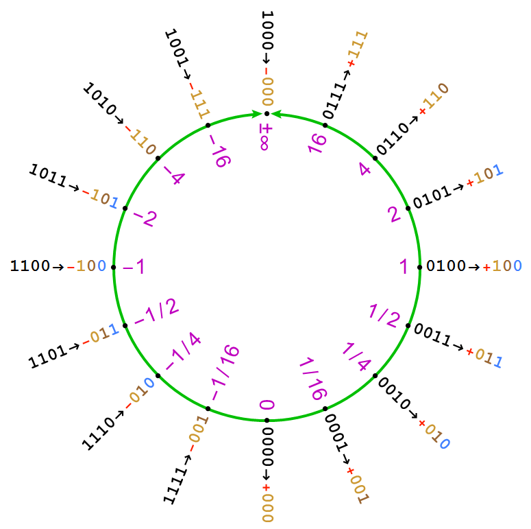

# Posit Refinement Visualization

Universal numbers, unums for short, are for expressing real numbers, and ranges of real numbers. 
There are two modes of operation, selectable by the programmer, _posit_ mode, and _valid_ mode.

In _posit_ mode, a unum behaves much like a floating-point number of fixed size, 
rounding to the nearest expressible value if the result of a calculation is not expressible exactly.
A posit offers more accuracy and a larger dynamic range than floats with the same number of bits.

In _valid_ mode, a unum represents a range of real numbers and can be used to rigorously bound answers 
much like interval arithmetic does.

The positive regime for a posit shows a very specific structure, as can be seen in the image blow:

Posit configurations have a very specific relationship to one another. When expanding a posit, the new value falls 'between' the old values of the smaller posit. The new value is the arithmetic mean of the two numbers if the expanding bit is a fraction bit, and it is the geometric mean of the two numbers if the expanding bit is a regime or exponent bit. Here is the starting progression from _posit<2,0>_ to _posit<7,1>_:

The _seed_ posit:

_posit<3,0>_:

_posit<4,1>_:

_posit<5,1>_:

_posit<6,1>_:

_posit<7,1>_:

