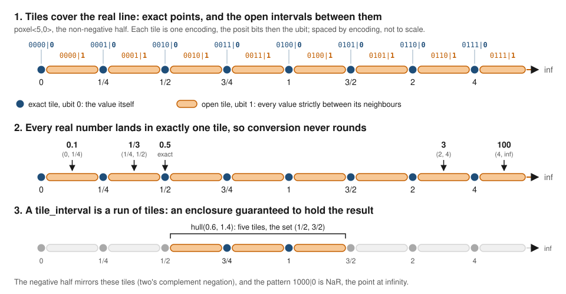

# A real with uncertainty bit

In *The End of Error*, John Gustafson adds one bit to a floating-point number, the **uncertainty bit** or **ubit**. With the ubit clear, the value is exactly the number the other bits encode. With the ubit set, the value lies somewhere in the open interval between that number and the next one. A result that does not land on a representable value is then never silently rounded: it is placed in the interval that contains it, and the ubit says so.

Universal has two ubit number systems:

| type | lattice | the ubit marks |
|---|---|---|
| [`areal<nbits, es>`](../number-systems/areal.md) | a float, sign-magnitude | the open interval to the next float |
| [`poxel<nbits, es>`](../number-systems/poxel.md) | a posit, two's complement | the open interval to the next posit |

This tutorial shows what the ubit promises and what it does not. It separates a **flag** (one tile) from an **enclosure** (a pair of tiles, `tile_interval`). It then measures both on six classic problems where IEEE-754 gives a confident wrong answer, or a correct-looking one that loses most of its digits.

---

## Tiles

The lattice points and the open intervals between them are called **tiles**. Together they cover the real line without gaps or overlap.



The figure uses `poxel<5,0>`, small enough to draw every tile, and it is spaced by encoding, not to scale.
1. **The tiling.** The eight lattice points are the exact tiles: their encodings end in ubit 0. The eight open intervals between them end in ubit 1, and stop short of the points they lie between, because an open interval excludes its ends. The last one, `(4, inf)`, holds everything above maxpos.
2. **Conversion.** Every real number lands in exactly one tile: 0.1 in `(0, 1/4)`, 1/3 in `(1/4, 1/2)`, 3 in `(2, 4)`, 100 in `(4, inf)`. 0.5 is a lattice point, so it is exact. Nothing is rounded to a neighbour.
3. **Enclosure.** A `tile_interval`, introduced below, is a contiguous run of tiles. The hull of 0.6 and 1.4 is five tiles, the open set `(1/2, 3/2)`.

In code, every real number converts to exactly one tile, and no conversion ever rounds:

```cpp
#include <universal/number/poxel/poxel.hpp>
using namespace sw::universal;

poxel9 x(0.1);     // (0.09375, 0.1015625), ubit set: 0.1 is not on the lattice
poxel9 y(0.125);   // 0.125, exact
```

Both types count the ubit in `nbits`: an `areal<16,5>` and a `poxel<16,2>` are both 16 bits wide. Overflow and underflow land on open end tiles, `(maxpos, inf)` and `(0, minpos)` and their negatives, so a ubit number never pretends a huge value is maxpos or a tiny one is zero.

## One tile is a flag

Arithmetic on single tiles uses **sticky-flag** semantics. The operation runs on the stored values, the exact result is placed in its tile, and the ubit is set if that result is inexact **or** either operand carried the ubit.

- With **exact** operands, the result tile **contains** the exact result. For both types this is checked exhaustively on small configurations.
- Once an operand is **uncertain**, the ubit stays set, but the tile no longer has to contain the true value:

```cpp
poxel9 third = poxel9(1) / poxel9(3);   // (0.3125, 0.34375), ubit set
poxel9 r     = third * poxel9(3);       // (0.9375, 1),       ubit set -- 1 itself is outside
```

The ubit is an honest *"this is not exact"*. It is not a bound on where the true value lies. In the Muller-Kahan problem below, a single `poxel` tile settles on 100 with its ubit set, while the true limit is 6.

## A pair of tiles is an enclosure

`tile_interval<Tile>` (`universal/utility/tile_interval.hpp`) carries two tiles, the run `[lo, hi]`, in the spirit of Gustafson's *valid*. It works with `poxel` and with `areal` tiles of up to 64 bits, and it is guaranteed to **contain** every result.

It relies on the property above: an operation on two *exact* tiles returns the tile that contains the exact result. Every interval operation is therefore evaluated on exact endpoints only. The one containing tile gives both directed roundings: its lower end bounds the result from below, and its upper end bounds it from above.

- **Open ends stay open.** `(0, minpos) + (0, minpos)` is strictly positive.
- **`sign()`** returns `positive`, `negative`, `zero` or `undecidable`, and never a wrong answer.
- **`cos`** is enclosed by the Taylor partial sums S_30 <= cos t <= S_28, evaluated in tile-interval arithmetic.
- **`sqrt`** is enclosed by bisection over the lattice: the tile of t * t contains t^2 exactly, so it orders t^2 against v without rounding.

```cpp
#include <universal/number/poxel/poxel.hpp>
#include <universal/utility/tile_interval.hpp>
using I = tile_interval<poxel<64, 2, std::uint64_t>>;

I x(1.0e-8);
I g = I(1) - cos(x) * cos(x) - (x * x + x * x) / I(4000);
g.sign();   // positive: g is in (9.5e-17, 1.01e-16); IEEE double reports -5e-20
```

When the format lacks the precision, the honest answer is **undecidable**, and that is what an enclosure reports.

---

## Six problems, measured

The applications in [`applications/precision/ubit`](https://github.com/stillwater-sc/universal/tree/main/applications/precision/ubit) compare rounding formats (float, double, posit), single tiles and tile intervals, and assert the outcome. Formats are compared at **equal storage**, with the ubit counted in the width. Every expected value was checked against exact arithmetic first (#1637).

### 1. Rump's polynomial

f(a, b) = 333.75 b^6 + a^2 (11 a^2 b^2 - b^6 - 121 b^4 - 2) + 5.5 b^8 + a / (2b), at a = 77617, b = 33096.

The exact value is **-54767/66192 = -0.827396059946821**. The polynomial part cancels to exactly -2 from terms near 7.9e36 = 2^123, so more than 120 bits are needed even to get the sign.

| format | result |
|---|---|
| float | about -6e29 to -8e29, depending on how the compiler evaluates it |
| double | about -1.2e21 (-1.18e21 or -1.33e21, depending on fused multiply-add) |
| posit<32,2> | **+1.17**: the wrong sign |
| areal<32,8>, poxel<32,2> single tile | 2.5e30 and 1.17, both with the ubit set |
| tile_interval, 32 and 64 bits | contains -0.8274; sign undecidable |

IEEE double has the correct (negative) sign here; it is wrong by 21 orders of magnitude. Every tile interval contains the true value and declines to name a sign, which is correct at these widths.

### 2. The Muller-Kahan recurrence

x_{n+1} = 111 - (1130 - 3000/x_{n-1}) / x_n, with Kahan's starting values x_0 = 11/2, x_1 = 61/11. The exact solution is x_n = (6^(n+1) + 5^(n+1)) / (6^n + 5^n), which tends to **6**. But 100 is the attracting fixed point, and the smallest rounding error excites it.

| n | exact | float | double | posit<32,2> | poxel<32,2> tile | tile_interval<poxel<32,2>> |
|---|---|---|---|---|---|---|
| 4 | 5.6746 | 5.6721 | 5.6746 | 5.6744 | 5.6747, u=1 | (5.6725, 5.6762) |
| 6 | 5.7491 | 4.9412 | 5.7491 | 5.6828 | 5.7785, u=1 | (4.9699, 6.3555) |
| 8 | 5.8113 | 160.50 | 5.8113 | -19.457 | 13.887, u=1 | (-inf, inf) |
| 14 | 5.9277 | 100 | 15.413 | 100 | 99.99996, u=1 | (-inf, inf) |
| 30 | 5.9958 | 100 | 100 | 100 | 100, u=1 | (-inf, inf) |

Every rounding format settles on 100. The single tile does too: its flag warns, but it is not an enclosure. The tile interval contains the exact iterate at every step, and once it can no longer bound the iterate it widens instead of converging to the wrong answer.

The *End of Error* form of this recurrence starts at v_1 = 2, v_2 = -4 and fails the same way; it is demonstrated in `muller.cpp` in the same directory.

### 3. The sign of det(M^k)

M = [1.61803398875 1; 1 0.61803398875], the golden-ratio matrix with its entries cut to 11 decimals. With the exact golden ratio det(M) would be 0. With these decimals det(M) = +2.351265625e-13 exactly, so det(M^k) = det(M)^k is **positive for every k**, about 1e-631 at k = 50. An orientation predicate needs only the sign.

| k | double | tile_interval, 32-bit | tile_interval, 64-bit |
|---|---|---|---|
| 1 | positive | undecidable | **positive** (areal and poxel) |
| 2 | positive | undecidable | undecidable |
| 5 | 0 (fused) / positive (unfused) | undecidable | undecidable |
| 20 | 0 (fused) / **negative** (unfused) | undecidable | undecidable |
| 50 | 0 (fused) / about +1e18 (unfused) | undecidable | undecidable |

How double fails depends on whether the compiler fuses m00 m11 - m01 m10 into a multiply-add, but it fails with full confidence either way. No tile interval ever asserts a wrong sign.

### 4. The BBP tail

S = sum over k >= 15 of 16^-k (4/(8k+1) - 2/(8k+4) - 1/(8k+5) - 1/(8k+6)) = **9.1e-22**. Is S in (0, 1e-16)?

Float and double answer correctly: 16^-15 = 8.7e-19 is well inside their range. The question bites at 16 bits:

| format (16 bits) | result |
|---|---|
| half | 0: flushed, so it cannot say S > 0 |
| posit<16,2> | 1.4e-17: rounded up to minpos, too large by a factor of 15000 |
| tile_interval<areal<16,5>> | (0, 1.2e-7): proves S > 0 |
| tile_interval<poxel<16,2>> | (0, 2.2e-16): proves S > 0 |
| tile_interval<poxel<16,3>> | (6.4e-22, 1.3e-21): **proves 0 < S < 1e-16** |

With standard parameters, both ubit formats prove S > 0, which half cannot. Neither can bound S below 1e-16, because their smallest tiles end at 1.2e-7 and 2.2e-16, and they say so. The same 16 bits spent as `poxel<16,3>` reach 2^-104 and decide the question. Dynamic range decides it, not an extra bit.

### 5. The Griewank structure near its minimum

g(x, y) = 1 - cos(x) cos(y) - (x^2 + y^2)/4000 at x = y = 1e-8. Expanding cos, g = x^2 (1 - 1/2000) - x^4/3 + ... = **+9.995e-17**.

| format | result |
|---|---|
| float, double, posit<32,2> | **-5e-20**: cos(1e-8) rounds to exactly 1, so the sign is wrong |
| tile_interval, 32-bit | contains g; undecidable |
| tile_interval<areal<64,11>> | (-5e-20, 4.4e-16): undecidable, as its 51 fraction bits are coarser than double's |
| tile_interval<poxel<64,2>> | (9.5e-17, 1.01e-16): **proves g > 0** |

The posit lattice carries 58 fraction bits near 1 at 64 bits, a spacing of 3.5e-18, which is fine enough to see 1e-16.

---

### 6. The roots of 3x^2 + 100x + 2: the dependency problem

x = (-b +- sqrt(b^2 - 4ac)) / (2a) at a = 3, b = 100, c = 2 (*The End of Error*, pp. 181-184). The roots are **r1 = -0.0200120144216363534...** and **r2 = -33.3133213189116969...**.

Two things make the small root hard:
- **Cancellation:** -b + sqrt(b^2 - 4ac) subtracts two numbers near 100 to get about -0.12.
- **The dependency problem:** a and b each occur twice. Interval arithmetic treats every occurrence as an independent variable, so an enclosure can be wider than the true range of the expression. When the operands are exact points the occurrences are the same number and nothing is lost. When they are ULP-wide, the repeated occurrences begin to cost.

Below, "as written" means the formula in its usual form, (-b +- sqrt(b^2 - 4ac)) / (2a). "Rearranged" means the algebraically equal r1 = 2c / (-b - sqrt(b^2 - 4ac)), which adds two numbers near -100 instead of cancelling them.

Rounding formats, paired by width, relative error:

| width | format | r1 as written | r1 rearranged | r2 |
|---|---|---|---|---|
| 16 | half | 4.1e-2 | 3.8e-4 | 2.5e-5 |
| 16 | posit<16,2> | 1.1 (more than 100%) | 3.8e-4 | 9.6e-4 |
| 32 | float | 5.6e-6 | 4.0e-8 | 3.5e-8 |
| 32 | posit<32,2> | 2.3e-6 | 5.4e-9 | 8.2e-9 |
| 64 | double | 1.3e-14 | < 1e-15 | < 1e-15 |

At 32 bits the posit is two to seven times more accurate than float on every root. At 16 bits half beats posit<16,2> on r1 as written and on r2. That is tapered precision at work. The first step, b^2 = 10000, sits where posit<16,2>'s regime has used 5 bits, leaving 8 fraction bits (a spacing of 32) against half's 10 (a spacing of 8). posit<16,2> stores b^2 as 9984 and the discriminant as 9952, so -b + sqrt(d) comes out as -0.25 instead of -0.120. The rearranged r1 carries the same discriminant error, but -b - sqrt(d) adds instead of cancelling, so the error is not amplified. There both formats land at 3.8e-4.

There is no posit<64,2> row. By default the library computes posit sqrt through double, so a 64-bit posit would only show double's error.

Tile intervals, counted in tiles (a lattice point or the open interval beside it, so n tiles span about n/2 ulps). The tightest possible enclosure of an irrational root is 1 tile. For ULP-wide a, b, c (the open tile just above 3, 100 and 2), it is the range spanned by the eight corner polynomials:

| format | r1 as written | r1 rearranged | tightest | ULP-wide: r1 as written | r1 rearranged | tightest |
|---|---|---|---|---|---|---|
| areal<16,5> | 10581 | 3 | 1 | 20821 | 7 | 7 |
| poxel<16,2> | 16385 | 7 | 1 | 17067 | 9 | 5 |
| areal<32,8> | 1365 | 3 | 1 | 5465 | 7 | 5 |
| poxel<32,2> | 1365 | 3 | 1 | 9559 | 9 | 5 |
| areal<64,11> | 1365 | 3 | 1 | 5465 | 9 | 5 |
| poxel<64,2> | 1367 | 3 | 1 | 9559 | 9 | 5 |

- **Cancellation dominates the formula as written.** Even with exact operands it is more than 100 times wider than the rearranged form. At 16 bits, poxel's r1 as written contains 0, so not even its sign is decided.
- **Dependency adds to it.** At 32 and 64 bits, ULP-wide operands make r1 as written four to seven times wider again. At 16 bits, where cancellation already dominates, the factor is 1.04 for poxel and 2 for areal. Even the rearranged form, where a and b still occur more than once inside sqrt(b^2 - 4ac), comes out 2 to 4 tiles wider than the tightest enclosure at 32 and 64 bits.
- **Reformulating fixes most of it.** The rearranged form lands within a few tiles of the best possible enclosure.

Every enclosure is verified exactly, with no reference decimals. Its endpoints and the coefficients are dyadic rationals, so the signs of q(x) = a x^2 + b x + c and q'(x) = 2a x + b at an endpoint are computed exactly in `einteger` arithmetic. Since the vertex -b/(2a) separates the roots, x >= r1 holds exactly when q'(x) > 0 and q(x) >= 0. The same test, run as a bisection over the tiles, gives the tightest enclosure.

This uses the enclosing `sqrt` of `tile_interval`, which needs no extra precision. The tile of t * t contains t^2 exactly, so comparing its key with v orders t^2 against v without rounding. A bisection over the lattice then finds the tile that contains sqrt(v).

#### The same problem in ucalc

`ucalc` (`tools/ucalc`) asks these questions interactively. The tile types are `areal16`
... `poxel64` (single tiles) and `areal16i` ... `poxel64i` (tile intervals); `x~` is the open
tile above `x`. `roots` does the whole problem:

```
$ ucalc "roots 3 100 2"
roots of a x^2 + b x + c with a = 3, b = 100, c = 2
  discriminant b^2 - 4ac
    areal16i   two real roots   (9968, 9984)
    ...
    exact: two real roots
  r1, the root the formula as written takes by cancellation
    type       form               tiles  tightest      over  decimals  sign        contains  box
    areal16i   as written         10581         1    10581x       0.0  negative    yes       (-0.041687, 0)
               stable                 3         1        3x       2.8  negative    yes       (-0.02005, -0.019989)
    poxel16i   as written         16385         1    16385x       0.0  undecidable yes       (-0.083374, 0.041687)
               stable                 7         1        7x       2.5  negative    yes       (-0.020081, -0.019958)
    ...
  precision sweep: the narrowest width that decides each question (bits; - = no width does)
    question                               areal   poxel
    number of real roots                      16       8
    sign of r1 as written                     16      32
    sign of r1 stable                         16       8
    sign of r2 as written                      8       8
    6 digits of r1 as written                 64      64
    6 digits of r1 stable                     32      32
    6 digits of r2 as written                 32      32
```

- **tightest** is the best box the type could state. An exact oracle computes it
  independently of the tile arithmetic, in exact dyadic arithmetic. **contains** checks,
  exactly, that the root's tile lies inside the computed box.
- **The sweep** turns the table above into answers. A poxel needs 32 bits to decide the
  sign of r1 as written, and 8 bits for the stable form.

With ULP-wide coefficients, `ubox` compares each formula with the tightest box. That box
belongs to the function, not the formula, so both forms of r1 have the same one:

```
poxel32i> a = 3~
poxel32i> b = 100~
poxel32i> c = 2~
poxel32i> ubox (-b + sqrt(b*b - 4*a*c)) / (2*a)
  type                       tiles              tightest        over  decimals  sign        box
  areal16i                   20821                     7       2974x       0.0  undecidable (-0.0625, 0.020844)
  poxel16i                   17067                     5       3413x       0.0  undecidable (-0.10419, 0.041687)
  areal32i                    5465                     5       1093x       3.6  negative    (-0.0200169906, -0.0200068094)
  ...
poxel32i> decide sign (-b + sqrt(b*b - 4*a*c)) / (2*a)
  ...
  narrowest type that decides it: areal32i
```

The oracle does not assume the corner argument of the table above; it proves it.
- Every value carries an interval derivative, so monotonicity in each coefficient is
  checked over the input box before the two corners are evaluated exactly.
- Where monotonicity cannot be shown, the oracle subdivides and brackets the box from both
  sides.

For this problem, every tightest box in the table is proven and agrees with the corner
polynomials. `rootbox` finds the roots without the formula, by bisecting on the sign of
the polynomial:

```
$ ucalc "rootbox 3*x^2 + 100*x + 2 for x in [-40, 0] poxel32i"
    poxel32i   root                   7  (-33.31332302, -33.31331921)
               ...
               root                   1  (-0.02001201455, -0.02001201408)
```

`tools/ucalc/scripts/13_quadratic_uncertainty.ucalc` runs all of these in order.

---

## What the ubit can and cannot do

| capability | IEEE float | one ubit tile (flag) | tile_interval (enclosure) |
|---|---|---|---|
| distinguish exact from approximate | no | yes: ubit = 0 means exact | yes |
| detect precision loss | silent | yes: the ubit is set | yes |
| guarantee the true value is inside | no | no: the tile can miss it | **yes** |
| avoid a confident wrong answer | no | warns, but may still show a wrong value | yes: decides, or says undecidable |
| decide a sign | always, sometimes wrongly | no | when provable |

## Lessons

- **A flag is not an enclosure.** A set ubit means "inexact", not "the truth is in this tile". Guarantees need a pair of tiles.
- **"Undecidable" is a correct answer.** Rump needs more than 120 bits. A 32- or 64-bit enclosure that says "I cannot tell" is right, and every rounding format is wrong.
- **Repeated operands cost, and reformulation recovers it.** In the quadratic formula a and b occur twice. With exact operands that is free; with ULP-wide ones the enclosure widens, and a single-occurrence form recovers most of the loss.
- **What is decidable depends on the formulation as much as the width.** The sign of the small root needs a 32-bit poxel in the formula as written, and an 8-bit one in the stable form.
- **Compare at equal storage, ubit included.** A one-bit mismatch (a 17-bit poxel against a 16-bit areal) flipped the BBP conclusion.
- **How rounding fails depends on the compiler.** Fused multiply-add changed both the digits of Rump's double result and the way double fails det(M^k). The enclosures did not change.
- **A tight enclosure needs a sound formulation.** Summing the BBP terms one at a time near minpos widens the upper bound at every step; factoring out 16^-15 keeps it tight.

## More examples from the book

The same directory has earlier demonstrations with `areal` single tiles:

| example | what it shows |
|---|---|
| `rump.cpp` | IEEE single, double and quad against the double-double, triple-double and quad-double cascades |
| `muller.cpp` | the v_1 = 2, v_2 = -4 recurrence: IEEE converges to 100, the ubit flags uncertainty from iteration 4 |
| `chaotic_bank.cpp` | Balance_n = n * Balance_{n-1} - 1 from e - 1: double goes negative, an impossible balance |
| `quadratic.cpp` | cancellation in b^2 - 4ac flagged by the ubit |
| `thin_triangle.cpp` | Kahan's thin triangle: the cancellation in s - a flagged |
| `newton.cpp` | Newton iteration, with the ubit showing when rounding affects the division |

*The End of Error* also treats Bailey's two-equation system (chapter 14) and the pendulum and two-body problems (chapters 19 and 20), where enclosures give guaranteed bounds on an ODE solution.

## Running the applications

From the repository root:

```bash
cmake -S . -B build -DUNIVERSAL_BUILD_APPLICATIONS=ON -DUNIVERSAL_BUILD_NUMBER_POXELS=ON
cmake --build build --target ubit_rump_polynomial ubit_muller_kahan ubit_geometric_predicates ubit_bbp_tail ubit_griewank_sign
ctest --test-dir build -R "ubit_(rump_polynomial|muller_kahan|geometric_predicates|bbp_tail|griewank_sign)"
```

Each application prints its comparison table and ends with its assertions and PASS or FAIL.

To explore interactively, build ucalc and run the quadratic script:

```bash
cmake -S . -B build -DUNIVERSAL_BUILD_TOOLS_UCALC=ON
cmake --build build --target ucalc
build/tools/ucalc/ucalc -f tools/ucalc/scripts/13_quadratic_uncertainty.ucalc
```

---

Sources:

- John L. Gustafson, *The End of Error: Unum Computing*, CRC Press, 2015
- https://rosettacode.org/wiki/Pathological_floating_point_problems
- https://www.johndcook.com/blog/2019/11/12/rump-floating-point/
- https://ubiquity.acm.org/article.cfm?id=2913029
- https://people.eecs.berkeley.edu/~wkahan/EndErErs.pdf
