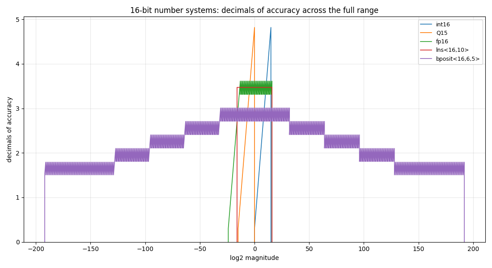
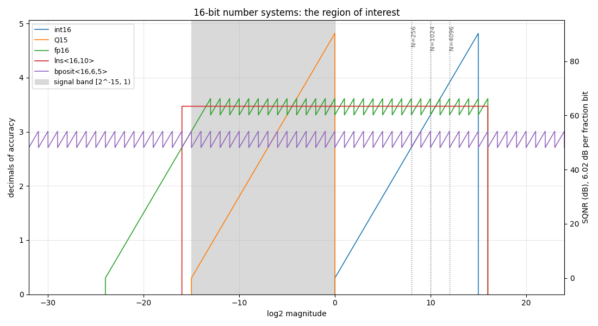
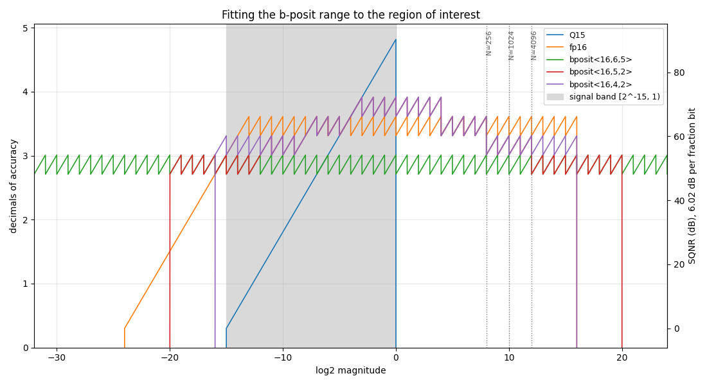
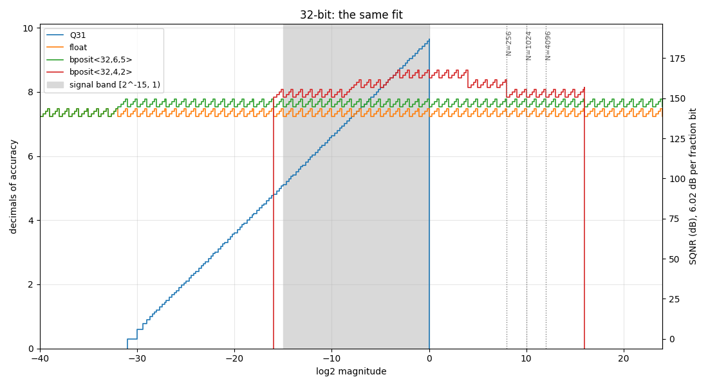

# Decimals of accuracy: choosing a number system by its precision profile

Every number system spends its bits on two things: **range** (how large and how small a value it can hold) and **precision** (how finely it divides the values in between). A precision profile shows where each system puts them. It plots, at every magnitude, how many decimal digits the system keeps.

This tutorial uses the profile to compare five 16-bit number systems. It then zooms into the magnitudes a signal-processing pipeline actually uses, notices that the standard b-posit wastes most of its encodings outside them, and fits a b-posit to the job.

## The measure

For an encoding x whose next larger encoding is x+, the spacing is ulp(x) = x+ - x. Rounding a real number to the nearest encoding makes a relative error of at most ulp / (2|x|). Expressed in decimal digits, that is Gustafson's **decimals of accuracy** (*The End of Error*, 2015):

    decimals(x) = -log10( ulp(x) / (2 |x|) )

A system has 0 decimals at magnitudes it cannot represent, below its smallest positive value or above its largest. (Averaged over an ulp, the relative error is ulp / (4|x|): the same curve, shifted up by log10(2) = 0.30.)

The profiles come from `precision_profile_of<T>()` in [`universal/utility/precision_profile.hpp`](https://github.com/stillwater-sc/universal/blob/main/include/sw/universal/utility/precision_profile.hpp). For types of up to 16 bits it decodes every encoding, so each curve below has about 32,000 points. Wider types are sampled a few points per binade.

## Generating the data

Build the comparison application. Run it with a directory, and it writes one CSV file per number system there, alongside the tables quoted below:

```bash
cmake -S . -B build -DUNIVERSAL_BUILD_APPLICATIONS=ON
cmake --build build --target dsp_precision_profiles
mkdir -p profiles
build/applications/mixed-precision/dsp/dsp_precision_profiles profiles
```

The figures are drawn by [`tools/notebooks/plot_precision_profiles.py`](https://github.com/stillwater-sc/universal/blob/main/tools/notebooks/plot_precision_profiles.py), which needs matplotlib.

## The full range

First, the whole picture: five 16-bit systems across everything they can represent.

```bash
python3 tools/notebooks/plot_precision_profiles.py \
    profiles/int16.csv profiles/Q15.csv profiles/fp16.csv profiles/lns_16_10_.csv profiles/bposit_16_6_5_.csv \
    --title "16-bit number systems: decimals of accuracy across the full range" \
    -o 16bit-full-range.png
```



Each system's shape is its design:

- **`int16`** starts at 1, its smallest positive value, and gains precision with magnitude: the spacing is always 1, so a larger value is relatively more precise. It peaks at 4.8 decimals at 2^15.
- **Q15**, `fixpnt<16,15>`, is the same line shifted down by 15 binades. It covers 2^-15 to just below 1.
- **fp16**, `cfloat<16,5>`, has a flat top: 10 fraction bits, 3.3 to 3.6 decimals, in every binade from 2^-14 to 2^15. Below that, its subnormals ramp down to 2^-24.
- **`lns<16,10>`** is perfectly flat at 3.47 decimals. A logarithmic system's relative spacing is the same everywhere, here across 2^-16 to 2^16.
- **`bposit<16,6,5>`**, the standard bounded posit, is a tent. It keeps 2.7 to 3.0 decimals near 1 and steps down by one fraction bit every 32 binades, out to 2^+-192. Its regime is capped, so it never drops below 4 fraction bits (1.5 decimals) and stops sharply at its bounded range.

The picture shows the trade every 16-bit format makes. The b-posit spans 384 binades and the integer formats about 15. The formats with the widest range keep the fewest digits.

## Zooming into the region of interest

A digital signal processing (DSP) pipeline does not use 384 binades:

- **The signal band.** Samples are normalized to [-1, 1). The precision just below 1.0 sets the quantization noise floor, at about 6.02 dB of SQNR per bit.
- **The floor.** Small filter coefficients and the tail of a spectrum sit down to about 2^-15 (-90 dBFS).
- **FFT growth.** An N-point FFT grows magnitudes by up to log2(N) bits: 2^8, 2^10 and 2^12 for N = 256, 1024 and 4096.

So the **region of interest** is [2^-15, 2^12]. The same five curves, restricted to it with `--xmin` and `--xmax`. `--dsp` shades the signal band, marks the FFT growth and adds an SQNR axis:

```bash
python3 tools/notebooks/plot_precision_profiles.py \
    profiles/int16.csv profiles/Q15.csv profiles/fp16.csv profiles/lns_16_10_.csv profiles/bposit_16_6_5_.csv \
    --dsp --xmin -32 --xmax 24 \
    --title "16-bit number systems: the region of interest" \
    -o 16bit-region-of-interest.png
```



At this scale each binade's sawtooth is visible. Precision is best at the top of a binade and drops by log10(2) where the spacing doubles. In this region:

- **Q15** is the most precise in the signal band, 4.52 decimals in [0.5, 1). It has nothing above 1.0, so an FFT must rescale at every stage. Below the band it falls off a cliff: at 2^-15 it is down to its last bit.
- **`int16`** cannot hold the signal band at all without a scale factor.
- **fp16** holds 3.3 to 3.6 decimals across the region, except its lowest binade: 2^-15 is subnormal, at 3.0. **`lns<16,10>`** is flat at 3.47.
- **`bposit<16,6,5>`** holds 2.7 to 3.0, the least of the floating-point formats. Its range reaches some 180 binades beyond the region on each side, and it pays for that range here.

## The standard b-posit's range is wasted

A 16-bit format has 32,767 positive encodings. How many of them land in the region of interest?

| type | range (log2) | positive encodings in [2^-15, 2^12] |
|---|---|---|
| `bposit<16,6,5>` | -192 .. 192 | **21.1 %** |
| fp16 | -24 .. 16 | 85.5 % |
| `lns<16,10>` | -16 .. 16 | 84.4 % |

Nearly four in five of the standard b-posit's encodings represent magnitudes between 2^-192 and 2^-15, or between 2^12 and 2^192. A DSP pipeline never produces them. Those encodings are not free. Every bit the regime spends reaching them is a fraction bit that the values in the region do not get.

## Fitting the range

A b-posit's range is set by its maximum regime size rS and its exponent size eS: it spans 2^+-(rS 2^eS). The question is which configuration covers [2^-15, 2^12] with the fewest bits spent on range. The application prints the candidates:

| type | range (log2) | encodings in the region | decimals in [0.5, 1) | worst in the region | floor (bits) |
|---|---|---|---|---|---|
| `bposit<16,6,5>` | -192 .. 192 | 21.1 % | 2.71 | 2.71 | 4 |
| `bposit<16,6,3>` | -48 .. 48 | 67.2 % | 3.31 | 3.01 | 6 |
| `bposit<16,6,2>` | -24 .. 24 | 89.8 % | 3.61 | 2.71 | 7 |
| `bposit<16,5,2>` | -20 .. 20 | 89.8 % | 3.61 | 2.71 | 8 |
| **`bposit<16,4,2>`** | **-16 .. 16** | **92.2 %** | **3.61** | **3.01** | **9** |
| `bposit<16,3,1>` | -6 .. 6 | 100.0 % | 3.91 | 0.00 | 11 |

- **`bposit<16,4,2>` is the best fit.** Its range, 2^+-16, just covers the region. It puts 92% of its encodings there and keeps at least 3.01 decimals across all of it. It never drops below 9 fraction bits, against 4 for the standard configuration.
- **`bposit<16,5,2>`** buys four more binades of headroom, up to 2^20 (million-point FFTs), for one bit of floor. It is the choice if the growth budget is uncertain.
- **`bposit<16,3,1>`** shows the limit. All its encodings fall inside the region, but its 2^+-6 range does not cover it: 0 decimals at 2^-15 and at 2^10. A fit must cover the region, not just sit inside it.

The fitted b-posits against fp16, the standard b-posit and Q15:

```bash
python3 tools/notebooks/plot_precision_profiles.py \
    profiles/Q15.csv profiles/fp16.csv profiles/bposit_16_6_5_.csv profiles/bposit_16_5_2_.csv profiles/bposit_16_4_2_.csv \
    --dsp --xmin -32 --xmax 24 \
    --title "Fitting the b-posit range to the region of interest" \
    -o 16bit-bposit-fit.png
```



The two fitted b-posits coincide from 2^-12 to 2^12, peaking at 3.91 decimals. They part only at the edges of the region, where `bposit<16,4,2>` keeps one more bit.

- **Against the standard `bposit<16,6,5>`**, the fitted configurations are one to three bits ahead at every magnitude in the region: up to 0.9 decimals, or 18 dB of SQNR, near 1.0.
- **Against fp16** the comparison is local, because a b-posit's precision is tapered:

  | magnitudes | `bposit<16,4,2>` against fp16 |
  |---|---|
  | 2^-4 to 2^4 | one bit ahead: 3.61 to 3.91 decimals against 3.31 to 3.61 |
  | 2^-8 to 2^-4, and 2^4 to 2^8 | the same |
  | 2^-15 to 2^-8, and 2^8 to 2^12 | one bit behind (tied at 2^-15, where fp16 is subnormal) |

  The b-posit concentrates its bits around 1.0, where a normalized signal's large samples, and most of its power, live. fp16 spreads them evenly.

That is the paper's point (*Closing the Gap Between Float and Posit Hardware Efficiency*, arXiv 2603.01615): a b-posit with a smaller eS suffices for signal processing, and the range it gives up is range the workload never uses.

## The same at 32 bits

The region of interest does not change with the width, so the same configuration fits:

```bash
python3 tools/notebooks/plot_precision_profiles.py \
    profiles/Q31.csv profiles/float.csv profiles/bposit_32_6_5_.csv profiles/bposit_32_4_2_.csv \
    --dsp --xmin -40 --xmax 24 \
    --title "32-bit: the same fit" \
    -o 32bit-bposit-fit.png
```



| type | range (log2) | decimals in [0.5, 1) | worst in the region | floor (bits) |
|---|---|---|---|---|
| `float` | -149 .. 128 | 7.22 | 7.22 | 0 (subnormals) |
| `bposit<32,6,5>` | -192 .. 192 | 7.53 | 7.53 | 20 |
| `bposit<32,5,2>` | -20 .. 20 | 8.43 | 7.53 | 24 |
| **`bposit<32,4,2>`** | **-16 .. 16** | **8.43** | **7.83** | **25** |

`bposit<32,4,2>` beats float across the whole region, by 0.6 to 1.2 decimals (2 to 4 bits), and never drops below 25 fraction bits. Q31 is more precise in the signal band, but like Q15 it has no headroom and fades below it.

## Summary

- **Start with the full range.** The profile's shape shows how a system divides its bits between range and precision.
- **Then zoom in.** Restrict the plot to the magnitudes the computation actually produces: the region of interest.
- **Count where the encodings land.** Encodings outside the region are not just unused; the bits that reach them come out of the precision inside it.
- **Size the format to the region.** For a b-posit, choose rS and eS so that 2^+-(rS 2^eS) just covers the region. Here `bposit<16,4,2>` is one to three bits ahead of the standard `bposit<16,6,5>` everywhere in the region, and one bit ahead of fp16 around 1.0.

The DSP results are also summarized in the [bposit](../number-systems/bposit.md) page, and the application that computes them is [`applications/mixed-precision/dsp/precision_profiles.cpp`](https://github.com/stillwater-sc/universal/blob/main/applications/mixed-precision/dsp/precision_profiles.cpp).
