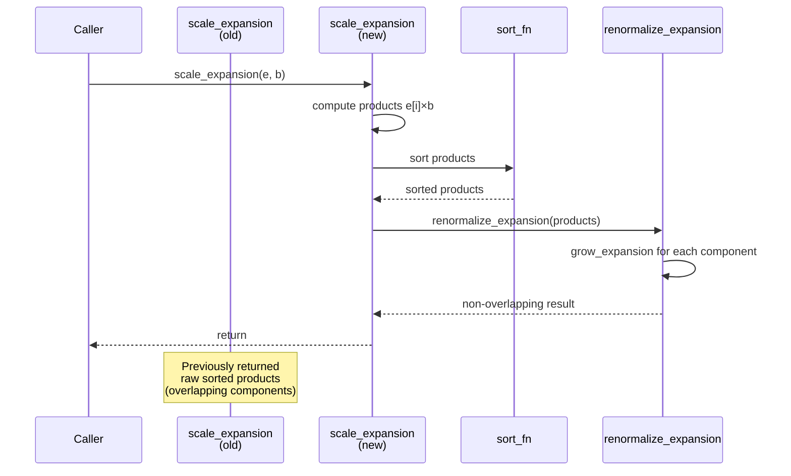

# Sequence Diagram for scale_expansion

```mermaid
sequenceDiagram
    participant Caller
    participant scale_expansion_old as scale_expansion<br/>(old)
    participant scale_expansion_new as scale_expansion<br/>(new)
    participant sort_fn
    participant renormalize_expansion

    Caller->>scale_expansion_new: scale_expansion(e, b)
    scale_expansion_new->>scale_expansion_new: compute products e[i]×b
    scale_expansion_new->>sort_fn: sort products
    sort_fn-->>scale_expansion_new: sorted products
    scale_expansion_new->>renormalize_expansion: renormalize_expansion(products)
    renormalize_expansion->>renormalize_expansion: grow_expansion for each component
    renormalize_expansion-->>scale_expansion_new: non-overlapping result
    scale_expansion_new-->>Caller: return

    note over scale_expansion_old: Previously returned<br/>raw sorted products<br/>(overlapping components)
```