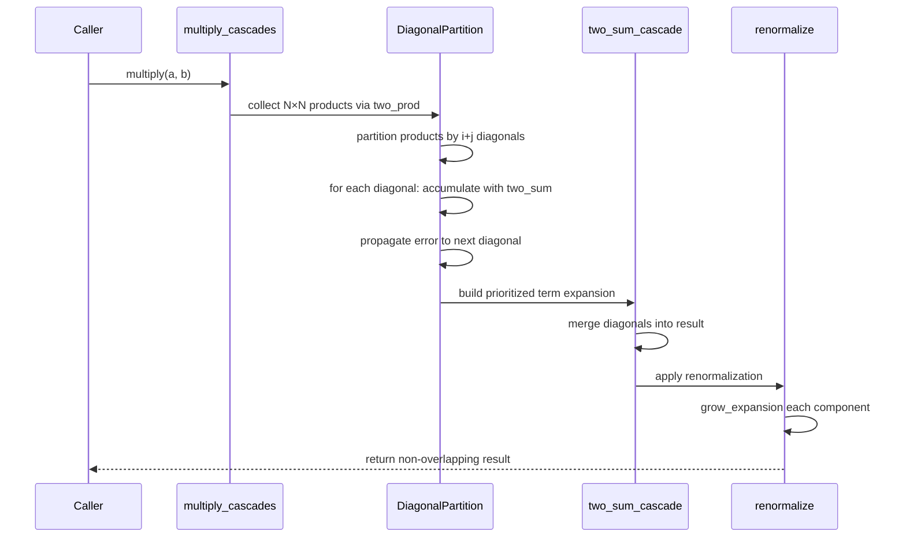

# Sequence Diagrams for multiply_cascades

```mermaid
sequenceDiagram
    participant Caller
    participant multiply_cascades
    participant DiagonalPartition
    participant two_sum_cascade
    participant renormalize

    Caller->>multiply_cascades: multiply(a, b)
    multiply_cascades->>DiagonalPartition: collect N×N products via two_prod
    DiagonalPartition->>DiagonalPartition: partition products by i+j diagonals
    DiagonalPartition->>DiagonalPartition: for each diagonal: accumulate with two_sum
    DiagonalPartition->>DiagonalPartition: propagate error to next diagonal
    DiagonalPartition->>two_sum_cascade: build prioritized term expansion
    two_sum_cascade->>two_sum_cascade: merge diagonals into result
    two_sum_cascade->>renormalize: apply renormalization
    renormalize->>renormalize: grow_expansion each component
    renormalize-->>Caller: return non-overlapping result
```
